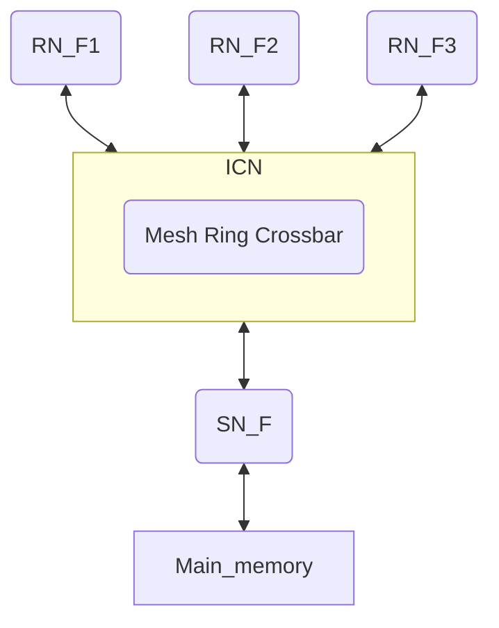

# 1. Introduction

## 1.1 Architecture overview

CHI架构提供了一个全面的分层规范，使用可扩展的CHI接口和片上互连来构建由多个组件组成的小型、中型和大型系统。CHI架构允许组件连接的拓扑结构具有灵活性，而且从系统性能、功率和面积要求出发。

基于CHI的系统的组件可以包括独立处理器、处理器集群、图形处理器、内存控制器、I/O桥、PCIe子系统和互连本身。

重要特征：

- scalable architecture，可扩展性。
- 分层协议：分成三层，协议层，网络层，链接层。其中协议层用于产生和处理请求和响应；网络层用于决定目的节点的ID，完成路由功能；链接层管理各个通道，在interconnect传输消息。
- 基于Packet-based的通信。
- CHI协议支持64byte cacheline，snoop filter和基于目录的系统，MESI和MOESI cache model，partitial和empty cache line状态。
- CHI事务包含多种transaction类型，支持atomic操作，通过Distributed Virtual Memory(DVM)操作支持虚拟内存管理。
- 支持retry
- 支持QoS
- 可配置的数据位宽
- ARM TrustZone支持事务粒度
- 基于生产者消费者的保序模型来优化transaction flow
- 支持错误报告和传播
- 使用Data Poisoning和per byte错误提示，以处理sub cache line错误。
- 功耗感知信号，使能flit-level的clock gating，支持clock-gating和power-gate controlr 激活和关闭流程.

### 协议层级

三个层级：协议层、网络层、链路层

| 层级     | 通信粒度    | 主要功能                                                     |
| -------- | ----------- | ------------------------------------------------------------ |
| Protocol | Transaction | 生成处理请求和响应，定义transaction中cache的状态，定义transaction流程，控制协议流控 |
| Network  | Packet      | 基于Packet发送消息，路由功能，决定目的节点ID                 |
| Link     | Flit        | 网络设备间的流控，链接通道死锁解锁                           |

## 1.2 Topyology

CHI是topology-independent，但是在一些特定优化的拓扑结构下可以更高效。比如Mesh，Ring，Crossbar。

## 1.3 Terminology

- Transaction: 事务，执行单次操作。
- Message: 协议层术语，消息，比如request，data request，snoop request. 一个data response可能包含多个packets。
- Packet: 在interconnect和endpoint间传输的粒度，即在总线和设备间传输的粒度。一个message可能包含多个packets。每个packet包含source ID和target ID。
- Flit: 最小的流控单元。一个packet可以包含多个flits。一个packet中所有Flits走相同的路径。注意：CHI中所有Packet都只有一个Flit。
- Phit: physical layer transfer unit. 一个flit可以包含多个phits。一个phit表示相邻的两个device间的一次传输。注意：CHI中所有Flit都只有一个Phit。
- PoS: Point of Serialization. 对不同的agents的Reuests进行保序。
- PoC: Point of Coherence. 让所有agent访问相同位置的内存时是看到相同的copy。在CHI中，PoC是HN-F Node。
- PoP: Point of Persistence. 在memory系统中，如果PoP存在，对于一个写操作，当系统下电时，memory能保存，系统上电时，memory能恢复。
- Downstream cache: 这是从Request Node的角度定义的。一个downstream cache表示RN通过CHI Request transaction请求的cache。一个Request Node可以发送一个带数据的请求并将数据allocate数据在downstream cache中。
- Requester: 请求发起的component，也可以叫Master。Requester也可以发送downstream请求信息，或者因为其他transaction而发出请求。
- Completer: 响应从其他component接收到的transaction。Completer可以是interconnect总线component，比如HN或MN，或者总线外的一个slave。
- Master: 一个可以独立发起transaction的agent。一般Master是系统的上层的agent，Master也叫Requester。
- Slave: 接收transaction和完成任务的agent。一般slave是系统中最底层的agent，Slave也叫Completer。
- Endpoint: slave的另一个名字。是transaction的最终目的地。
- Protocol Credit: 一个Credit，表示Completer保证可以接收一个transaction。
- Link layer Credit: 一个Credit，表示link的另一端保证可以接收一个flit。一个L-credit用于链接层的single hop。
- ICN: interconnect的缩写。一个ICN可能是ring/mesh/crossbar或其他拓扑的swtich，一个ICN可能包含HN, MN等。ICN的拓扑是根据实现具体定义的。
- IPA: Intermediate physical Adress. 在两级地址翻译中，第一级翻译的结果是IPA，第二级翻译的结果是PA。
- RN: Request Node. 生成protocol transaction，包括read和write，发送到ICN。
- HN: Home Node. 位于ICN中，接收来自RN的protocol transaction，完成所需的一致性动作，并返回Response。
- SN: Slave Node. 接收来自HN的请求，完成所需的动作，并返回Response。
- MN: Miscellaneous Node. 位于ICN中，接收来自RN的DVM消息，完成所需的动作，并返回Response。
- IO Coherent Node: 不接收任何Snoop requests的RN。RN可以生成snoopable request和non-snoopable request。IO Cochrent node接收数据并没有一致性状态。
- Snoopee: 接收snoop的RN。
- Write-Invalidate protocol: RN写一个cache line前，必须invalidate系统中其他所有share该cache line的copy。这样的协议就叫Write-invalidate protocol.
- In a timely manner: protocol不能定义一个绝对的时间内某个事情必须发生。但是，在一个idle系统中，protocol会往前和完成任务，不需要额外的动作。
- Don't Care: 一个域段可以被设置成任意值，包括reserved域段和非法值。任何component接收到包含Don't Care值的域段的Packet时，必须忽略这些域段。
- Inapplicable: 一个表示消息处理过程中不会使用的域段。

## 1.4 transaction classification

transaction可分为6类：Read, Write, Dataless, Atomic, Snoop, Other.

Read
• ReadNoSnp, ReadNoSnpSep.
• ReadOnce.
• ReadOnceCleanInvalid.
• ReadOnceMakeInvalid.
• ReadClean.
• ReadNotSharedDirty.
• ReadShared.
• ReadUnique.

Dataless
• CleanUnique.
• MakeUnique.
• Evict.
• StashOnceUnique.
• StashOnceShared.
• CleanShared.
• CleanSharedPersist.
• CleanSharedPersistSep.
• CleanInvalid.
• MakeInvalid.

Write
• WriteNoSnpPtl, WriteNoSnpFull.
• WriteUniquePtl, WriteUniqueFull.
• WriteUniquePtlStash, WriteUniqueFullStash.
• WriteBackPtl, WriteBackFull.
• WriteCleanFull.
• WriteEvictFull.

Atomic
• AtomicStore.
• AtomicLoad.
• AtomicSwap.
• AtomicCompare.

Other
• DVMOp.
• PrefetchTgt.
• PCrdReturn.

Snoop
• SnpOnceFwd.
• SnpOnce.
• SnpStashUnique.
• SnpStashShared.
• SnpCleanFwd.
• SnpClean.
• SnpNotSharedDirtyFwd.
• SnpNotSharedDirty.
• SnpSharedFwd.
• SnpShared.
• SnpUniqueFwd.
• SnpUnique.
• SnpUniqueStash.
• SnpCleanShared.
• SnpCleanInvalid.
• SnpMakeInvalid.
• SnpMakeInvalidStash.
• SnpDVMOp.

## 1.5 Coherence overview

硬件一致性使系统中共享内存的组件不需要用软件的方法来维护cache一致性。

当两个component对同一个memory地址写时，所有的components看到的顺序是相同的。

### 1.5.1 Coherency model

一致性协议通过强制每次写到该地址时，不存在多于一个副本，确保所有主机在任何给定地址位置都观察到正确的数据值。每次写某个地址后，其他master可以获取该数据的新副本保存到自己的cache，允许存在多个cache副本。

所有一致性按cache line粒度。一条cache line为64 byte。

协议不要求main memory随时更新最新的数据，只有当该数据不再cache中有副本时，才需要更新回main memory。（需要不强制要求，但是也允许有cache副本时更新main memory。）



协议允许component决定同一个地址的数据(即一条cache line的数据)在cache中是否只有一个副本(即一个copy)，或者有多个副本：

- 如果数据只有一个copy，拥有该数据的master可以修改该cache line，而不通知系统中的其他master。
- 如果数据可能被其他master拥有，要修改该cache line的master必须通过适合的transaction通知其他master。

### 1.5.2 Cache state model

当一个component访问某个cache line时，为了判断是否需要action，协议定义了cache状态。每个cache状态都基于以下几个cache line特征：

- Valid, Invalid: Valid说明cache line存在于cache中。Invalid说明cache line不存在于cache中。
- Unique, Shared: Unique表示cache line只存于在当前cache中，Shared表示cache line可能存在于其他cache中(但不保证)。
- Clean, Dirty: Clean表示当前cache不负责更新main memory，Dirty表示cache line已被修改，当前cache必须保证main memory最终会更新。
- Full, Partial, Empty： Full表示cache line所有byte都是valid，partial表示可能部分bytes是valid，但不是所有byte都valid，Empty表示cache line没有byte是valid。

```
      |-------------Valid---------------|-----Invalid------|
      |-----Unique----|-----Shared------|                  |
------|---------------------------------|                  |
      |     UC        |       SC        |                  |
Clean |---------------------------------|                  |
      |     UCE       |       -         |                  |
------|---------------------------------|                  |
      |     UD        |       SD        |                  |
Dirty |---------------------------------|                  |
      |     UDP       |       -         |                  |
----- |---------------------------------|------------------|
```

## 1.6 Component naming

CHI协议包含以下三大类Node：

RN: Request Node. 生成协议transaction，包括read/write to the ICN。

- RN-F: Fully coherent Request Node. 
  - 包含硬件一致性cache
  - 允许生成协议定义的所有transaction类型
  - 支持所有Snoop transaction
- RN-D: IO coherent Request Node with DVM support
  - 不包含硬件一致性cache
  - 只允许生成协议定义的部分transaction类型
  - 接收DVM transaction
- RN-I: IO coherent Request Node
  - 不包含硬件一致性cache
  - 只允许生成协议定义的部分transaction类型
  - 不接收DVM transaction
  - 不要求snoop功能

HN: Home Node. 位于interconnect总线中，接收来自RN的transactions。

- HN-F: Fully coherent Home Node.
  - 可接收除DVMOp外所有类型的请求。
  - 包含一个Point of Coherence (PoC)，通过snoop、snoop response、sending a single response RN-F节点来管理一致性。
  - 包含一个Point of Seralization (PoS)，管理多个memory请求的保序。
  - 可能包含一个目录或snoop filter，用于减少冗余snoops。
  - 注意：HN-F可能包含一个集成的ICN cache。
- HN-I: Non-coherent Home Node.
  - 只能处理部分协议定义的请求类型
  - 不包含Point of Coherence (PoC)，不能处理Snoopable request。对于snoopable request的回执，必须respond一个遵循协议的消息。
  - 包含一个Point of Seralization (PoS)，管理多个目标为该IO subsystem的IO requests的保序。
- MN: Miscellaneous Node.
  - 接收来自RN的DVM transaction，完成需求的action，返回response。

SN: Slave Node. 接收来自HN的请求，完成 需求的action，返回response。

- SN-F: 用于Normal Memory，可以处理Non-snoopable read和write，atomic request，包括exclusive variants, 支持Cache Maintenance Operation (CMO) 请求。
- SN-I: 用于外设或Normal Memory，可以处理Non-snoopable read和write，atomic request，包括exclusive variants, 支持Cache Maintenance Operation (CMO) 请求。

## 1.7 Read data source

在基于CHI的系统中，一个Read请求可以从不同的source获取data。包括：

- ICN中的cache
- Slave Node
- Peer RN-F

为了降低时延，支持：

- Direct Memory Transfer (DMT)，允许Slave Node直接发送数据给Requester。
- Direct Cache Transfer (DCT)，允许peer RN-F直接发送数据给Requester。

## 参考资料
https://developer.arm.com/documentation/ihi0050/D/?lang=en
