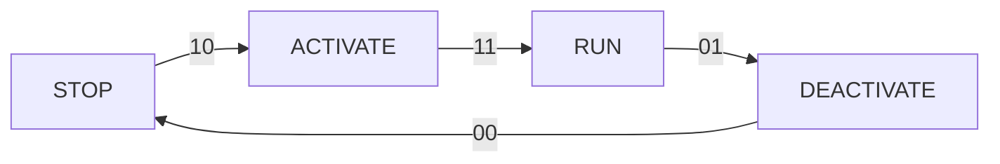

# 13. Link Handshake

## 13.1 Clock, and initialization

## 13.2 Link layer Credit

transmitter只有收到一个L-Credit信号后，才能发送一个flit给receiver。（注意这里说收到一个L-Credit信号，我理解L-Credit是一个个发送的，即可以每一拍发一个；而不是拉高时有L-Credit，低位时没有L-Credit。）

每个通道都有一个LCRDV信号。

receiver最少要提供1个L-Credit，最多可提供15上L-Credit。

receiver发送了多少L-Credit，就要保证可以接收多少flit。

当link激活active时，receiver必须及时提供L-Credit给transmitter，不依赖其他行为。

注意，L-Credit收到的当拍不能使用。

## 13.3 Low power signaling

提高low power的信号：

- Flit Level Clock Gating：每个通道有一个额外的信号，用于指示下一个cycle可能有传输。
- Link Activation：指示允许接口进入安全状态，以便接口进入低功耗状态，从而进入clock-gated和power-gated状态。
- Protocol Activity Indication：指示是否有transaction在进行，用于其他低功耗技术的决定。

## 13.4 Flit level clock gating

FLITPEND指示下一cycle是否将有一个flit要传输。每个channel有一个FLITPEND信号。

FLITPEND的要求：

- 该信号必须前一拍于flit传输。
- 当asserted表示允许，但不强制，transmitter在下一拍发送flit。
- 当deasserted时，要求transmitter在下一拍不要发送flit。
- transmitter允许永久保持该信号asserted。比如，当它不知道什么时候会发送flit时。
- 当transmitter没有L-Credit时，允许assert该信号。
- 没有发送flit时，允许assert或deassert该信号。

## 13.5 Interface activation and deactivation

提供一个机制使得interface可以在full running operational状态和low power状态中切换。在operational state中切换时，包括exiting from reset，交换L-Credits和Link flits是很重要的，要小心控制以避免丢失flit或credit。

#### handshake

采用双信号、四状态的握手机制。

```
|-------------|                       |----------|
|             |                       |          |
|             | ----LINKACTIVEREQ---> |          |
| Transmitter | <---LINKACTIVEACK---- | Receiver |
|             | =======Payload======> |          |
|             | <------Credit-------- |          |
|             |                       |          |
|-------------|                       |----------|
```

interface operation定义4个状态：

- RUN: 有一个ongoing exchange的flit。
- STOP: 在low power状态，所有credit被receiver保存，transmitter不允许发送flit。
- ACTIVATE: 从STOP到RUN的状态。
- DEACTIVATE: 从RUN到STOP的状态。

ACTIVATE和DEACTIVATE是瞬时状态，预期会在短时间内进入稳态。协议没有规定瞬时状态的时间，但预期这个时间是确定的。



信号和状态：

| state      | LINKACTIVEREQ | LINKACTIVEACK |
| ---------- | ------------- | ------------- |
| STOP       | 0             | 0             |
| ACTIVATE   | 1             | 0             |
| RUN        | 1             | 1             |
| DEACTIVATE | 0             | 1             |

行为总结：

| state      | Transmitter                                                  | Receiver                                           |
| ---------- | ------------------------------------------------------------ | -------------------------------------------------- |
| STOP       | Must not send flits.<br/>Will not receive credits.           | Must not send credits.<br/>Will not receive flits. |
| ACTIVATE   | Must not send flits.<br/>Must accept credits.                | Must not send credits.<br/>Will not receive flits. |
| RUN        | Can send flits.<br/>Must accept credits.                     | Must accept flits.<br/>Can send credits.           |
| DEACTIVATE | Must not send flits, except for credit return flits.<br/>Must accept credits.<br/>Must return credits. | Must accept flits.<br/>Must stop sending credits.  |

#### Race conditions

#### Response to new state

#### Determining when to move to ACTIVATE or DEACTIVATE

#### Multiple channels in the same direction

## 13.6 Transmit and receive link Interaction

### 13.6.2 Tx and Rx state machines

描述Tx和Rx状态机间允许的关系。

## 13.7 Protocol layer activity indication

### 13.7.1 Introduction

SACTIVE信号指示有transaction正在进行。

### 13.7.2 TXSACTIVE signal

竖状图中的粗体，即表示一个transaction正在进行。

### 13.7.3 RXSACTIVE signal

当RXSACTIVE asserted, receiver必须及时回应link activation request。当RXSACTIVE deasserted，允许延迟回应link activation request。

### 13.7.4 Relationship between SACTIVE and LINKACTIVE

SACTIVE是协议层行为指示。当TXSACTIVE and RXSACTIVE都deasserted时，可以认为该node是inactive的。

LINKACTIVE是Link层行为指示。当receiver为TxStop或RxStop时，可以认为node或interconnetc的Link层是inactive的。
