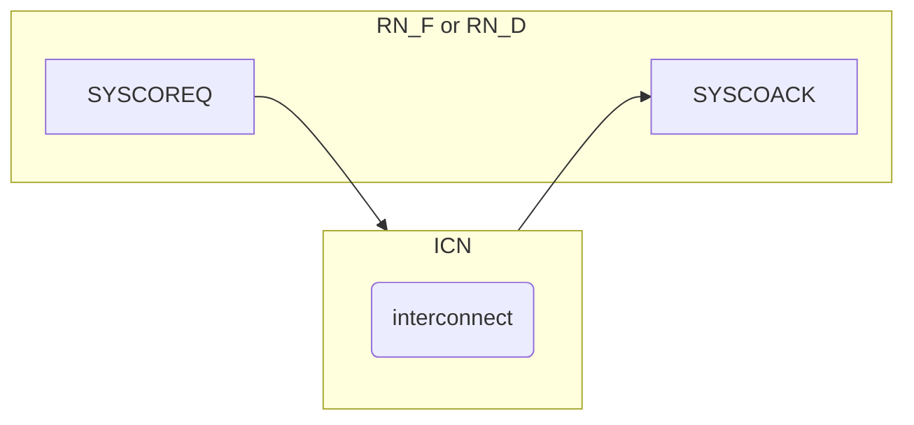

# 14. System Coherency Interface

## 14.1 Overview

system coherency interface信号：

- SYSCOREQ: Master coherency request.
- SYSCOACK: Interconnect coherency acknowledge.

SYSCOREQ and SYSCOACK信号必须与CLK信号同步。如果他们跨clock domain，要求clock domain crossing bridge是同步的。



## 14.2 Handshake

```
            t0            t1            t2                 t3                   t4
SYSCOREQ   _______________|`````````````````````````````````|___________________________________________
SYSCOACK   _____________________________|````````````````````````````````````````|_____________________
           Co Disabled     Co Connect    Co Enabled          Co Disconnect        Co Disabled
```

### 14.2.1 RN rules

### 14.2.2 Interconnect rules

### 14.2.3 Protocol states
