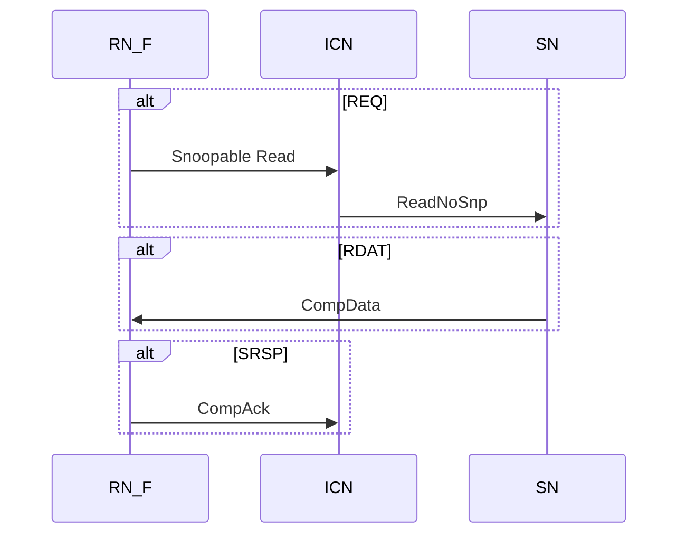

# 2. Transactions

## 2.1 Channels overview

Node间的通信是基于Channel的。

下表描述了channel的缩写名字、特征。

| Channel | RN channel designation                                       | SN channel designation                       |
| ------- | ------------------------------------------------------------ | -------------------------------------------- |
| REQ     | TXREQ, 发送请求                                              | RXREQ, 接收请求                              |
| WDAT    | TXDAT, 发送数据 (写数据, atomic数据，snoop数据，forward数据) | RXDAT, 接收数据(写数据，atomic数据)          |
| SRSP    | TXRSP, 发送回应 (snoop response, completion acknowledge)     | -                                            |
| CRSP    | RXRSP, 接收回应(response from the Completer)                 | TXRSP, 发送回应(response from the Completer) |
| RDAT    | RXDAT, 接收数据(read data, atomic data)                      | TXDAT, 发送数据(read data, atomic data)      |
| SNP     | RXSNP, 接收Snoop                                             | -                                            |

## 2.2 Channel fields

每个Channel包含一些Channel field，有些会影响transaction的结构 (比如数据size，是否允许retry，是否保序)。

### 2.2.1 Transaction request fields

| Field          | Affects structure | Description                                                  |
| -------------- | ----------------- | ------------------------------------------------------------ |
| QoS            | No                | Quality of Service priority.                                 |
| TgtID          | No                | Target ID                                                    |
| SrcID          | No                | Source ID                                                    |
| TxnID          | No                | Transaction ID                                               |
| LPID           | No                | Logical Processor ID                                         |
| PGroupID       | No                | Persistence Group ID                                         |
| Deep           | No                | Deep persistence                                             |
| ReturnNID      | No                | Return Node ID                                               |
| ReturnTxnID    | No                | Return Transaction ID                                        |
| StashNID       | No                | Stash Node ID                                                |
| StashNIDValid  | Yes               | Stash Node ID Valid                                          |
| StashLPID      | No                | Stash Logical Processor ID                                   |
| StashLPIDValid | No                | Stash Logical Processor ID Valid                             |
| Opcode         | Yes               | Request opcode                                               |
| Addr           | Yes               | Address                                                      |
| NS             | No                | Non-secure                                                   |
| Size           | Yes               | Data size associate with the transaction, 决定packet的数量   |
| AllowRetry     | Yes               | Allow Retry                                                  |
| PCrdType       | No                | Protocol Credit Type, 指示Retry时Protocol Credit域类型       |
| ExpCompAck     | Yes               | Expect CompAck. 指示transaction会包含一个Completion Acknoledge消息。 |
| MemAttr        | No                | Memory attribute.                                            |
| SnpAttr        | No                | Snoop attribute                                              |
| SnoopMe        | No                | Snoop Me. 指示Home必须决定是否给requester发送snoop           |
| LikelyShared   | No                | Likely Shared. 给downstream cache一个allocation hint         |
| Excl           | No                | Exclusive access                                             |
| Order          | Yes               | Order requirement                                            |
| Endian         | No                | Endianness. atomic transaction的数据的大小端                 |
| TraceTag       | No                | Trace Tag. 提供debugging, tracing, performance测量的支持     |
| MPAM           | No                | Memory system performance resource Partitioning and Monitoring |
| RSVDC          | No                | User defined                                                 |

### 2.2.2 Snoop request fields

| Field          | Affects structure | Description                                                  |
| -------------- | ----------------- | ------------------------------------------------------------ |
| Qos            | No                | Quality of Service priority                                  |
| TxnID          | No                | transaction ID                                               |
| FwdNID         | No                | Forward Node ID                                              |
| FwdTxnID       | No                | Forward Transaction ID                                       |
| StashLPID      | No                | Stash Logical Processor ID                                   |
| StashLPIDValid | No                | Stash Logical Processor ID Valid                             |
| VMIDExt        | No                | Virtual Machine ID Extension                                 |
| SrcID          | No                | Source ID                                                    |
| Opcode         | Yes               | Snoop opcode                                                 |
| Addr           | No                | Address                                                      |
| NS             | No                | Non-secure                                                   |
| DoNotGoToSD    | No                | Do Not Go To SD(shared dirty) state                          |
| DoNotDataPull  | Yes               | No Not Data Pull. Stash request不使用Data Pull特征           |
| RetToSrc       | Yes               | Return to Source. 指示是否回data                             |
| TraceTag       | No                | Trace Tag. 提供debugging, tracing, performance测量的支持     |
| MPAM           | No                | Memory system performance resource Partitioning and Monitoring |

> Snoop request没有定义TgtID

### 2.2.3 Data fields

data packet数据包可以通过RDAT或WDAT通道发送。packet中的Data field不影响transaction structure。

| Field      | Description                                                  |
| ---------- | ------------------------------------------------------------ |
| Qos        | Quality of Service priority.                                 |
| TgtID      | Target ID                                                    |
| SrcID      | Source ID                                                    |
| TxnID      | Transaction ID                                               |
| HomeNID    | Home Node ID                                                 |
| Cbusy      | Completer Busy                                               |
| DBID       | Data Buffer ID                                               |
| Opcode     | Data opcode, 指示数据包是read/write/snoop transaction        |
| RespErr    | Response Error status                                        |
| Resp       | Resp status                                                  |
| FwdState   | Forward State                                                |
| DataPull   | Data Pull. 指示在数据响应中包含隐含的读取请求                |
| DataSource | Data source                                                  |
| CCID       | Critical Chunk Identifier. 复制原始transaction请求的地址偏移量 |
| DataID     | Data Identifier. packet中data的地址偏移                      |
| BE         | Byte Enable. 对于写数据，指示哪些byte是valid                 |
| Data       | Data payload                                                 |
| DataCheck  | Data check. 检测DAT数据包中的数据错误                        |
| Poison     | Poison. 指示一组数据字节先前已损坏，告知未来使用者数据已损坏 |
| TraceTag   | Trace Tag. 提供debugging, tracing, performance测量的支持     |
| RSVDC      | User defined                                                 |

### 2.2.4 Response fields

| Field    | Description                                              |
| -------- | -------------------------------------------------------- |
| Qos      | Quality of Service priority.                             |
| TgtID    | Target ID                                                |
| SrcID    | Source ID                                                |
| TxnID    | Transaction ID                                           |
| Cbusy    | Completer Busy                                           |
| DBID     | Data Buffer ID                                           |
| PGroupID | Persistence Group ID                                     |
| PCrdType | Protocol Credit Type                                     |
| Opcode   | Data opcode, 指示response type                           |
| RespErr  | Response Error status                                    |
| Resp     | Resp status                                              |
| FwdState | Forward State                                            |
| DataPull | Data Pull. 指示在数据响应中包含隐含的读取请求            |
| TraceTag | Trace Tag. 提供debugging, tracing, performance测量的支持 |

## 2.3 Transaction structure

本节描述三种transaction类型：

• Request transactions without a Retry.

• Request transactions with a Retry.

• Snoop transactions.

### 2.3.1 Request transaction structure

#### Snoopable Read DMT struct

DMT限制：

- 只有当所有使用该TxnID的response返回后，requester才可以reuse这个TxnID
- Home等待以下条件满足才能给SN-F发送DMT reqeust：
  - 没有Snoop request要发送
  - 如果Snoop request已经发送，要等Snoop response没有Dirty copy的cache line已经返回
  - 如果Snoop response返回一个partial Dirty copy的cache line，那DMT只有等data写回SN-F而且completion已经收到后，才能发送DMT
  - 如果snoop是forwarding类型，则没有cache line结果会forward到requester。

> Home可以合并DMT和DCT，但必须等DCT response收到后，才能发送DMT给SN-F。

#### transaction structure with DCT

Snoopable read transaction with DCT时，数据直接从Snooped RN-F发送到orignal Requester。流程如下：

1. Requester发送Snoopable read request on REQ channel, 如ReadClean, ReadNotShareDirty, ReadShared, ReadUnique.
2. ICN发送Snp*Fwd给RN-F on SNP channel
3. RN-F forward read data和response on DAT Channel.
4. RN-F返回forward SnpRespFwded response给ICN on SRSP channel, 说明read data已经forward给Requester
5. 因为ExpComAck bit设置了，所以Requester必须返回CompAck on the SRSP

依赖：

- Completer必须在相关request已经收到后，才能发ComData。
- Request收到第一个Data packet read data后，就可以发CompAck，而不用等收到所有read data. (CHI Issue C时要等收到所有read data)

#### Transaction structure without Direct Data Transfer

transaction没有Direct Data Transfer时，从Requester视角，transaction和Snoopable Read transaction with Direct Data Transfer是一样的。流程如下：

1. Requester发送Snoopable read request on REQ channel, 如ReadClean, ReadNotShareDirty, ReadShared, ReadUnique.
2. Completer返回read data on RDAT channel
3. 因为ExpComAck bit设置了，所以Requester必须返回CompAck on the SRSP

依赖：

- Completer必须在相关request已经收到后，才能发ComData。
- 如果data是通过Slave或snooped Agent发送的，ICN在接收到第一个packet时就可以forward CompData packet。
- Request收到第一个Data packet read data后，就可以发CompAck，而不用等收到所有read data. (CHI Issue C时，要等收到所有read data，也不允许Comp和Data分离)

#### ReadNoSnp, ReadOnce, ReadOnceCleanInvalid, ReadOnceMakeInvalid

ReadNoSnp直接从Slave Node或interconnect获得数据，不需要snoop其他master。

ReadOnce* transaction对应一个读取操作，会snoop其他master，但Requester不会allocate cache line数据到自己的cache中。（用过即扔）

> 注意：`ReadOnce*`获取coherent data的一个snapshot快照，如果Requester在自己的cache或buffer中拥有该data，则`ReadOnce*`后cache不再保留该数据。

ReadNoSnp和`ReadOnce*`可以选择Odering要求。当选择Ordering时，Home必须保证transaction保序。

ReadNoSnp和`ReadOnce*`可以选择ExpCompAck，transaction则包含CompAck response。从功能上ReadNoSnp是不要求CompAck response的，因为RN不会保留该cache line的副本。但是使用CompAck允许在一些场景下使用DMT和分离Comp和Data response。

#### ReadNoSnp and ReadOnce* structure with DMT

流程如下：

1. Requester发送ReadNoSnp and ReadOnce* on REQ channel
2. 如果Order field设置了(可选)，当order建立时，ReadReceipt response必须通过CRSP channel返回。
3. ICN发送readNoSnp给SN on REQ channel
4. 如果Order[1:0]设置成0b01，SN返回ReadReceipt response给ICN on CRSP channel
5. SN直接返回read data和transaction response with Compdata opcode给Requester on RDAT channel。
6. 如果ExpCompAck设置了(可选)，Requester必须返回CompAck on SRSP channel.

使用ReadReceipt response可以减小ReadNoSnp和ReadOnce* transaction with DMT的生命周期life time，因为read acknowledgement可以尽快deallocate在Home上的transaction。当Home使用early deallocate时，ReadReceipt变成必须的。该类lifetime reduction transaction的要求如下：

- Home必须设置Order[1:0]为0b01
- Oder[1:0]设置为0b01的请求，Slave必须发送ReadReceipt，而且保证请求必须能接收，不能发送RetryAck。
- Home接收到ReadReceipt后就可以deallocate请求，不用等requester的CompAck
- Home在deallocate请求后，也可以接收CompAck。

#### ReadOnce* structure with DCT

流程如下：

1. Requester发送ReadOnce* on REQ channel
2. ICN发送Snp*Fwd给RN-F on SNP channel
3. RN-F forward read data和response on DAT Channel.
4. RN-F返回forward SnpRespFwded response给ICN on SRSP channel, 说明read data已经forward给Requester
5. 如果ExpComAck bit设置了（可选），Requester必须返回CompAck on the SRSP

#### ReadNoSnp and ReadOnce* structure without Direct Data Transfer

流程如下：

1. Requester发送ReadNoSnp and ReadOnce* on REQ channel
2. 如果Order filed设置了，ICN发送ReadRecipt on CRSP channel
3. Completer返回read data和response with Compdata on RDAT channel
4. 如果ExpComAck bit设置了（可选），Requester必须返回CompAck on the SRSP

rules:

- 如果有ReadReceipt：Completer必须等收到请求后再发ReadReceipt。一般ReadReceipt早于CompData发送/接收，也允许晚发。
- Completer必须等收到请求后再发CompData
- 如果数据来自Slave或snooped Agent，Request收到第一个Data packet read data后，就可以发CompAck，而不用等收到所有read data.

#### Summary of impact of ordering and CompAck rules

| Order[1:0] | ExpCompAck | DMT  | DCT  | Notes                                                        |
| ---------- | ---------- | ---- | ---- | ------------------------------------------------------------ |
| 00         | 0          | Y    | Y    | Home不需要被通知transaction completion。对于DMT，Home必须获取Request Accepted response from SN，保证request不会被retry。 |
| 00         | 1          | Y    | Y    | Home不需要被通知transaction completion。对于DMT，通过获取Request Accepted response from SN，或者等待CompAck，保证request不会被retry。 |
| 01         | -          | -    | -    | Not permitted                                                |
| 10/11      | 0          | N    | Y    | 对于DCT，Home通过SnpRespFwded或SnpRespDataFwded来判断transaction completion |
| 10/11      | 1          | Y    | Y    | 对于DMT，Home通过ComAck判断transaction completion。对于DCT，Home通过SnpRespFwded或SnpRespDataFwded来判断transaction completion。 |

#### Reads with separate Non-data and Data-only responses

Read* transaction支持分离Non-data response和Data-only response。Non-data response from Home. Data-only response from either Home or Slave. 

> 注意：分离Non-data和Data-only response在CHI Issue C版本不支持

该特性不在以下类型transaction应用：

- Atomic transaction
- Exclusive transaction
- Ordered ReadNoSnp 和 ReadOnce* transaction without CompAck

Read* with separate Comp and Data responses流程如下：

- Comp from Home and Data from Slave:
  1. requester发送Read*请求
  2. Home发送RespSepData response给requester，告诉requester transaction已经同地址保序，数据由另一个response发送
  3. Requester发送CompAck，对于Ordered transaction，CompAck必须在接收到第一个data response packet后才发送。
  4. ICN发送ReadNoSnpSep给SN
  5. SN发送ReadReceipt给Home
  6. SN发送DataSepResp给Requester。
- Comp and Data from Home:
  1. requester发送Read*请求
  2. Home发送RespSepData response给requester，告诉requester transaction已经同地址保序，数据由另一个response发送
  3. Home发送DataSepResp给requester，返回read data
  4. Rquester发送CompAck给Home

依赖rules:

- DataSepResp and RespSepData必须在接收到请求后才能发送。RespSepData只能由Home发送，RespSepData可以由Home或Slave发送
- CompAck必须等接收到RespSepData后再发送
  - 对于Non-ordered请求，这是允许但不是必须的，
  - 对于ReadOnce和readNoSnp with Order，这是必须的
- Completer发送完所有data packet前，不能等待CompAck
- ReadNoSnpSep必须等收到请求后，所有Snoop response收到后，再发送
- ReadReceipt必须在收到ReadNoSnpSep后再发送，而且不能返回RetryAck
- ReadReceipt表示Salve保证能接收Home发来的请求。
- 对于ReadOnce和ReadNoSnp transaction with Order，包含分离Comp和Data response，Home不能发送ReadReceipt response，Home发送RespSepData就暗示包含了ReadReceipt。

对于所有case，使用分离data response和Home response时，相当于允许合并CompData response。

#### Dataless

Dataless transaction可以分为Non-cache maintenance(Non-CMO)和Cache Maintenance(CMO)两种

Non-CMO transactions are:
• CleanUnique.
• MakeUnique.
• Evict.
• StashOnceUnique.
• StashOnceShared.

这些transaction的功能：

- 获取许可来保存一个cache
- 更新snoop filter的状态
- 移动数据到更靠近的节点，预期未来使用

对于Non-CMO dataless transaction，只有一个response，流程如下：

1. Requester发送请求 on REQ channel
2. Completer返回Comp response on CRSP channel
3. 如果ExpCompAck设置了，Requester必须返回CompAck on SRSP channel
   - 对于CleanUnique, MakeUnique, ExpCompAck必须设置
   - 对于Evict, StashOnceUnique, StashOnceShared，ExpCompAck必须不设置

rules:

- Comp必须等收到请求后再发送
- CompAck必须等收到Comp后再发送

CMO transactions are:
• CleanShared.
• CleanSharedPersist.
• CleanSharedPersistSep.
• CleanInvalid.
• MakeInvalid.

这些CMO请求用来维护系统中不同level的cache。

除了CleanSharedPersistSep，只有单个response。CleanSharedPersistSep可以有1个或2个response。流程如下：

1. Requester发送请求 on REQ channel
2. Completer返回Comp response on CRSP channel
3. 对于CleanSharedPersistSep，Completer还会返回Persist response给requester。Completer允许合并发送Comp和Persist为一个CompPersist response.

rules:

- Comp必须等收到请求后再发送。如果有其他downstream Home的observer，Home必须等待downstream返回Comp后，才返回Comp给Requester。
- 对于CleanSharedPersistSep:
  - Home允许但不期望设置ReturnNID为自己。
  - 如果Home是Point of Persistence：Home允许forward CleanSharedPersistSep给Slave，如果Home不forward，那Home必须发送Persist response。Home允许合并发送Comp和Persist为一个CompPersist response。
  - 如果请求发给Slave Node：Slave必须发送Comp response，不能发retry。如果有downstream的observer，Slave Node必须保证所有同地址的earlier write被系统所有observer观察到后，再发Comp。Slave Node必须发送Persist response给requester，表示保证所有同地址写non-volatile mmeory已经完成，地址数据最新的而且下电不丢失。如果是目标是volatile memory，可以立刻返回Persist response，该场景不能返回error.

#### Writes

Write transactions include the following:
• WriteNoSnp.
• WriteUnique.
• WriteBack.
• WriteCleanFull.
• WriteEvictFull.

##### WriteNoSnp and WriteUnique

WriteNoSnp包括WriteNoSnpPtl, WriteNoSnpFull

WriteNoSnp transaction执行store操作，而不用通知其他master。

WriteUnique包括WriteUniquePtl, WriteUniqueFull，WriteUniquePtlStash, WriteUniqueFullStash

WriteUnique transaction执行store操作，可能需要snoop其他Snoopable Requesters(RN-Fs)，以获取store的权限。

Non-CopyBack write包括WriteNoSnp和WriteUnique。

Non-CopyBack transaction有一个可选的行为，该行为由Order field决定。

Non-CopyBack transaction流程如下：

1. Requester发送Non-CopyBack请求
2. Completer有以下选择：
   - 返回separate responses:
     - 返回DBIDResp response，表示可以接收write data
     - 返回Comp response，表示transaction被其他requesters已观察到
   - 返回合并的CompDBIDResp response:
     - 表示可以接收write data
     - 表示transaction被其他requesters已观察到
3. requester发送write data NonCopyBackWrData on WDAT。write data可以分多次发送
4. 如果ExpCompAck设置了，completer(requester)要发送CompAck，也可以合并data和Comp为NCBWrDataCompAck

rules：

- 分离的DBIDResp和Comp，或合并的CompDBIDResp，必须在interconnect接收到请求后再发送
- WriteData必须在Requester收到DBIDResp或CompDBIDResp后再发送
  - 如果DBIDResp和Comp是分离的：
    - 一般DBIDResp早于Comp发送，但允许二者乱序
    - 一般DBIDResp早于Comp收到，但允许二者乱序
    - requester必须在收到DBIDResp后再发送write data，requester不能等待Comp后再发送write data
    - requester允许等待DBIDResp后再发送NCBWrDataCompAck或分离的CompAck和NCBWrData
    - requester允许等待发送WriteData后再发送Comp response
  - 如果CompAck是需要的：
  - CompAck必须收到DBIDResp或CompDBIDResp response后再发送
  - requester先收到DBIDResp response时，表示可以发送合并的NCBWrDataCompAck，或分离的NCBWrData或CompAck
  - requester先收到Comp response时，允许等待DBIDResponse response收到后再发全并的NCBWrDataCompAck
  - 当分离发送时，requester允许乱序发送WriteData和CompAck
  - 当合并发送时，requester必须在所有data transfers发送NCBWrDataCompAck

>  在CHI Issue D版本之前，WriteNoSnp不允许设置ExpCompAck

##### CopyBack

The CopyBack transactions are:
• WriteBackPtl, WriteBackFull.
• WriteCleanFull.
• WriteEvictFull.

CopyBack transaction，除了WriteEvictFull，是为了更新main memory或a downstream cache的一个一致性位置。

WriteEvictFull transaction是为了更新a downstream cache的一个一致性位置。一个WriteEvictFull不会传播出它所在的Snoop domain。

CopyBack transaction的流程如下：

1. requester发送CopyBack on REQ Channel
2. Completer返回合并的CompDBIDResp response on CRSP channel. 表示可以接收write data, 同时表示request完成前会接收所有有相同地址的snoop
3. Requester收到CompDBIDResp后，发送write data, CopyBackWrData on WDAT channel. write data可以通过多次transfer发送。

rules:

- CompDBIDResp必须在Completer收到请求发再发送
- WriteData必须等Requester收到CompDBIDRersp后再发送

#### Atomics

atomic transaction可以分成2类：

- 只返回complete response: AtomicStore
- 返回数据和complete response：AtomicLoad, AtomicSwap, AtomicCompare

流程如下：

1. Requester发送Atomic transaction on REQ channel
2. 对不同的atomic类型，Completer有不同的选择：
   - 如果是AtomicStore
     - 返回分离的response
       - DBIDResp response，表示能接收write data
       - Comp response，表示transaction已被其他Requester观察到
     - 返回合并的CompDBIDResp，表示能接收write data，而且transaction已被其他Requester观察到
   - 如果是Atomic Load, AtomicSwap, or AtomicCompare
     - 返回DBIDResp response，表示能接收write data
     - 返回read data和对应的Compdata response
3. Requester发送数据以及对应的NonCopyBackWrData on WDAT channel。AtomicCompare的数据可以使用多次transfer发送。

rulse:

- DBIDResp和Comp，或CompDBIDResp必须在completer收到请求后再发送
- CompData必须等Completer收到请求后再发送
- WriteData必须等Requester收到DBIDResp或CompDBIDResp后再发送
- 如果是AtomicStore而且分离发送DBIDResp和Comp：
  - 一般DBIDresp早于Comp发送，但也允许乱序
  - Requester必须在收到DBIDResp后再发Write Data
  - Requester不能一定等收到Comp再发Write Data
  - Completer允许等收到WriteData后再发送Comp response
- 如果是AtomicLoad, AtomicSwap, or AtomicCompare：
  - 一般DBIDresp早于CompData发送，但也允许乱序
  - 一般DBIDresp早于CompData收到，但也允许乱序
  - Requester必须在收到DBIDResp后再发Write Data
  - Requester不能一定等收到Comp再发Write Data
  - Completer允许等收到WriteData后再发送Comp response

##### Self-snoop in Atomic transactions

协议允许self-snooping类型的Atomic transaction，Self-snooping由SnoopMe bit域控制。Request-Response rulse of self-snooping in Atomic transactions:

- 因为RN不会invalidate自己的cached copy，发出Atomic request之前，必须依赖self-snooping：
  - invalidate自己的cache copy of the cache line
  - 获取一份copy of the cache if Dirty
- Home Node:
  - 如果SnoopMe bit设置了，而且Home判断requester拥有该cache line，必须发一个snoop给Requester，
  - 如果SnoopMe bit设置了，而且Home判断requester不拥有该cache line，允许但不强制给requester发送snoop
  - 如果SnoopMe bit没设置，允许但不强制给requester发送snoop
  - Atomic request对应期望发送SnpUnique，但也允许发送SnpCleanInvalid

> Atomic request with SnoopMe处理过程中，RN允许发送CopyBack请求
>
> CopyBack请求处理过程中，RN允许发送Atomic request with SnoopMe

#### Miscellaneous request types

##### DVM

Misc transactions include the following:
• DVM.
• PrefetchTgt.

DVM transaction用于发送Distributed Virtual Memory (DVM)操作。

流程如下：

1. Requester发送DVMop请求 on REQ channel
2. Completer返回DBIDResp response，表示能接收write data
3. Requester发送write data NonCopyBackWrData On WDAT channel。DVM transaction只有一个data transfer发生。
4. completer返回Comp response on CRSP channel

rulse:

- DBIDResp必须等Completer收到相关请求后再发送
- Comp必须等Completer收到相关请求后再发送
- 如果DVMop是Non-sync DVMOp，interconnect允许但不强制等待WriteData再发送Comp
- Completer允许投机合并Comp和DBIDResp为CompDBIDResp response
- WriteData必须等待收到DBIDResp再发送

##### PrefetchTgt

PrefetchTgt是指Request Node直接发送请求给Slave Node来读取一个shareable memory地址。该请求用于让Slave Node取出和缓存main memory数据，用于接下来的读请求。

PrefetchTgt处理流程是Requester发送PrefetchTgt request on REQ channel给SN。PrefetchTgt transaction不包含response

rulse:

- Requester可以在发出请求后立刻deallocate该请求。
- SN必须接收请求，而且不能retry。
- SN可以drop该请求，不作任何处理。

### 2.3.2 Transaction Retry sequence

除了PrefetchTgt，所有request transaction，都可以有retry sequence。

#### retry sequence

Request transaction第一次发送没有Protocol Credit(P-credit)。如果transaction没有被Completer接收，Completer必须返回RetryAck response，表示transaction没有被接收，当提供适合的credit后可以再次发送。第二次发送transaction时，包含了credit，保证请求会被接收。

transaction的retry sequence流程如下：

1. Requester发送request，不包含P-credit, on REQ channel
2. Completer返回RetryAck on CRSP channel
3. Completer可以接收请求时，提供PGrdGrant response on CRSP channel，表示可以重发transaction
4. Requester重发transaction，包含credit，on REQ channel

rulse:

- RetryAck必须等Completer收到相关请求后再发送
- PCrdGrant必须等Completer收到相关请求后再发送
- RetryAck一般先于PCrdGrant发出，也允许RetryAck和PCrdGrant乱序
- RetryAck一般先于PCrdGrant收到，也允许RetryAck和PCrdGrant乱序
- 包含credit的transaction必须在收到RetryAck和PCrdGrant后再发送

#### Not retrying a transaction

协议支持在接收到RetryAck后不重发请求。流程和Retry sequence基本一样，除了最后Requester发送的是PCrdReturn，表示这是个空的transaction，把credit返回给Completer。

Not retrying的rulse和retry sequence一样。

### 2.3.3 Snoop transactions

Snoop transaction是从interconnect发给Request Node：

- RN-F要求能接收所有类型的Snoop transaction
- RN-D只支持接收SnpDVMOp transaction
- RN-F和RN-D必须回应接收到的Snoop requests，除了DVMop(Sync)，及时的，而且不依赖任何未完成的请求。

snoop transaction structure的几种选择：

• Snoop with response to Home.
• Snoop with Data to Home.
• Snoop with Data return to Requester and response to Home.
• Snoop with Data return to Requester and Data to Home.
• Snoop DVM operation and response to Misc Node.

snoop transaction可以用来stash data在snoopee中。stash snoop transaction structure的几种选择：

• Stashing snoop with Data from Home.
• Stashing snoop with Data using DMT.

#### Snoop with response without Data to Home

Snoop transaction with response to Home 流程如下：

1. ICN发送Snoop request on SNP channel
2. RN返回SnpResp on SRSP channel

rules:

- SnpResp必须等收到相关请求后再发送

#### Snoop with response with Data to Home

Snoop transaction with Data to Home流程如下：

1. ICN发送Snoop request on SNP channel
2. RN返回数据和对应的response，使用SnpRespData或SnpRespDataPtl，on DAT channel

Snoop request包括：

• SnpOnceFwd, SnpOnce.
• SnpCleanFwd, SnpClean.
• SnpNotSharedDirtyFwd, SnpNotSharedDirty.
• SnpSharedFwd, SnpShared.
• SnpUniqueFwd, SnpUnique.
• SnpCleanShared.
• SnpCleanInvalid.

snoop with data to Home rules：

- SnpRespData或SnpRespDataPtl需要但不强制等接收到Snoop request再发送。

#### Snoop with Data forwarded to Requester without or with Data to Home

Snoop transaction with Data forwarded流程如下：

1. ICN发送Snoop request on SNP channel
2. Snooped RN forward data给Requester，使用CompData on WDAT channel，以及给Home发送SnpRespFwded on SRSP channel，或者给Home发送数据，用SnpRespDataFwded on WDAT channel

Snoop request/response rules for Forward snoops：

- SnpRespFwded or SnpRespDataFwded必须等待收到对应的Snoop request后再发送
- CompData必须等收到对应的Snoop requester后再发送
- Snoopee发送SnpRespFwded or SnpRespDataFwded and CompData可以乱序
- CompAck必须等待第一个Data reponse packet收到后再发送

#### Stash snoops

stash snoop有两个例子：

1. ICN给RN-F发送SnpUniqueStash，Data response来自某个Snoopee，Data来自Home。
2. ICN给RN-F发送SnpStashShared，数据来自SN-F，并且使用DMT

#### Snoop DVMOp

SnpDVMOp transaction流程如下：

1. ICN发送两个Snoop request SnpDVMOp on SNP channel (为什么是两个？因为一个flit带不完所有的信息)
2. RN回复单个SnpResp snoop response on SRSP channel

rulse:

- SnpResp必须等待两个Snoop request都收到后再发送

## 2.4 Transaction identifier fields

每个transaction由一个或多个不同的packets组成，在ICN中传输。每个packet中，包含一组identifier field，用来提供种信息。

TgtID, SrcID

TxnID, DBID, ReturnTxnID, FwdTxnID

DataID, Critical Chunk Identifier(CCID)

LPID, StashLPID

PGroupID

StashNID

ReturnNID FwdNID

HomeNID

## 2.5 Details of transaction identifier fields

除了PrefetchTgt，transaction request需要一个TxnID，而且TxnID必须对于Requester唯一。

10-bit filed用来定义TxnID，支持1024个outstanding transactions。Requester允许重复使用TxnID，当收到：

- 收到所有之前使用相同的value的相关的transaction的response
- 收到之前使用相同的value的RetryAck response

PrefetchTgt request的TxnID可以是任意值。

>  CHI Issue B版本，PrefetchTgt的TxnID必须是0
>
>  在CHI Issue D版本之前，TxnID为8-bit 256个outstanding

当所有response接收到后，或收到RetryAck response后，Home发给Slave的Request使用的TxnID，可以被Home重用

retry的transaction不要求使用相同的TxnID

> ...剩下更多细节等精读

## 2.6 Transaction identifier field flows

- The fields included in each packet are:

— For a Request packet: TgtID, SrcID, TxnID, StashNID, StashLPID, ReturnNID and ReturnTxnID.
— For a Response packet: TgtID, SrcID, TxnID and DBID.
— For a Data packet: TgtID, SrcID, TxnID, HomeNID and DBID.
— For a Snoop packet: SrcNID, TxnID, FwdNID, FwdTxnID and StashLPID.

- 颜色相同表示值相同
- 箭头表示使用之前的值生成新的值，用于后续的packets
- *表示初始生成值
- 小括号表示是一个固定值（fixed value），比如SrcID
- X表示该field是invalid
- R表示允许TgtID重映射

### 2.6.1 Read transactions

ID value transfer with DMT

ID value transfer with DMT and separate Comp and Data

ID value transfer with DCT

ID value transfer without Direct Data Transfer

### 2.6.2 Dataless transactions

ID value transfer in a CleanSharedPersistSep transaction

### 2.6.3 Write transactions

CopyBack transaction: Requester接收到DBID后，发送WriteData时使用DBID的值作为TxnID

WriteNoSnp transaction

WriteUnique transaction

StashOnce transaction

### 2.6.4 DVMOp transaction

DVMOp transaction的identifier fields和WriteNoSnp一样

### 2.6.5 Transaction requests with Retry

retry时DBID无效，PCrdType有效。

第一次request和retry的两次TxnID不同。

### 2.6.6 Protocol Credit Return transaction

协议支持在接收到RetryAck后不重发请求。流程和Retry sequence基本一样，除了最后Requester发送的是PCrdReturn，表示这是个空的transaction，把credit返回给Completer。

PCrdReturn Request返回一个granted credit给Completer。

TxnID不使用，而且必须是0。

## 2.7 Logical Processor Identifier

Logical Processor Identifier (LPID)在以下transaction使用而且必须填写正确：

- For any Non-snoopable Non-cacheable or Device access: ReadNoSnp, WriteNoSnp
- For Exclusive accesses：ReadClean,  ReadShared, ReadNotSharedDirty. CleanUnique. ReadNoSnp. WriteNoSnp

> 对于其他transaction，LPID表示发出transaction的原始logical processor，但是这不是协议需要的，是可选的。

## 2.8 Ordering

在理解Ordering之前，要先理解Memory Attributes。见2.9.3章节

### 2.8.1 Multi-copy atomicity

符合以下2个条件时，Write定义为multi-copy atomic:

- 所有写到相同的地址而且是串行的，即被所有Requester看到相同的Order，虽然部分Requester可能没有看到所有的写。
- 读要等到所有Requester都观察到写后才返回。

两个地址的cache line address和NS attribute相同，那他们有相同的coherence, observability, and hazarding

### 2.8.2 Completion Response and Ordering

为了保证transaction之间的保序，从相同或其他的agent发出的transaction，Comp, RespSepData, CompData, or Persist response要求：

- 对于Non-cacheable or Device location，RespSepData or CompData response保证transaction对应的location被所有agent的later transaction看到。
- 对于Read transaction to Cacheable location，CompData or DataSepResp response保证transaction对应的location被所有agent的later transaction看到。
- ...

### 2.8.3 Completion acknowledgement

从Requester发出的transaction和不同Requester发出的Snoop transaction的order，由完成确认(Completion acknowledgement)来控制。

Read transaction发送CompAck的顺序如下：

1. RN-F收到Comp, RespSepData or CompData, or both RespSepData and DataSepResp, 然后再发送CompAck
2. HN-F等待CompAck才能接着往下对相同的地址发送snoop，除了ReadOnce*。对于CopyBack transaction，WriteData暗示CompAck，HN-F必须等接收到WriteData后再发送相同地址的snoop。

这个序列保证了RN-F接收到transaction的完成和对同一cache line的监听，其顺序与从HN-F发送的相同。这可确保以正确的顺序观察到同一cache line的transaction。

当RN-F处于一个transaction中，除了ReadNoSnp and ReadOnce*, 在收到Comp和发出CompAck中间，它保证不会接收相同地址的Snoop。

对于WriteNoSnp and WriteUnique transactions，需要CompAck，RN在收到Comp/DBIDResp/CompDBIDResp后发出CompAck。

RN发送ExpCompAck field和生成CompAck的规则：

- RN-F发送的Read transaction必须包含CompAck response，除了ReadNoSnp and ReadOnce*
- RN-F发送ReadNoSnp and ReadOnce*也允许包含CompAck
- StashOnce, CMO, Atomic or Evict transactions必须不包含CompAck
- RN-I or RN-D允许但不要求包含CompAck
- RN-I or RN-D的Dataless or Atomic transactions必须不包含CompAck
- RN发送ordered ReadNoSnp and ReadOnce* transactions想使用DMT时，必须包含CompAck，
- 对于Write transaction，只有WriteUnique and WriteNoSnp transactions包含Order Write时能使用CompAck

SN不要求支持CompAck

HN-F或HN-I和SN-F或SN-I通信时，不能发送CompAck

### 2.8.4 Ordering semantics of RespSepData and DataSepResp

当Requester收到DataSepResp时，可以认为Read transaction全局可见，因为没有行为可以修改接收到的read data。

Home要保证初始一个transaction之前，所有需要的snoop transaction已经完成，比如ReadNoSnpSep。

### 2.8.5 Transaction ordering

transaction需要满足以下其中一种保序：

- Request Order：同Agent同地址保序
- Endpoit Order: 同Agent同地址保序，而且Request保序
- Ordered Write Observation: 对同一个agent的前后多个写操作，保证系统的其他agent观察保序。
- Request Accepted: Completer保证接收request时会发送一个确认。

#### Ordering requirements

以下transaction的Order filed应是非0值：

• ReadNoSnp.
• ReadNoSnpSep.
• ReadOnce*.
• WriteNoSnp.
• WriteUnique.
• Atomic.

#### CopyBack Request order

RN-F发送同cache line请求前，必须等收到前一个CopyBack transaction的CompDBIDResp response。允许同cache line的SnoopMe Atomic transaction在收到CompDBID前发出。

#### Streaming Ordered Write transactions

适用于提高有序写入观察（OWO）写入流效率的架构机制以及相应的约束，仅适用于WriteUnique和WriteNoSnp事务。

如果请求者要求按照发出的顺序观察一系列写入事务，则请求者可以等待写入完成后再发出序列中的下一个写入。这种观察顺序通常称为有序写入观察。本规范提供了一种称为流式有序写入的机制，以更有效地流式传输此类有序写入事务。

流式有序写入机制依赖于有序写入观察排序要求和 CompAck 的使用。在使用流式有序写入解决方案时，请求者和 HN-F 的职责是：

- 请求者必须将 Order 字段设置为需要有序写入观察，并在写入请求上设置 ExpCompAck。
- 写入请求中的有序写入观察要求向 HN-F 指示，此写入的一致性操作的完成不能依赖于后续写入的一致性操作的完成。
- 请求者必须等待 DBIDResp、CompDBIDResp 或 Comp 进行写入事务，然后才能发送下一个写入请求。
- 请求者在收到相应写入的 DBIDResp、CompDBIDResp 或 Comp 以及所有先前相关有序写入的 Comp 响应后，必须发送 CompAck 响应。如果要发送写入数据，则允许请求者将 CompAck 与 WriteData 响应组合成 NCBWrDataCompAck 响应。当请求者将 CompAck 与 WriteData 响应组合时，它必须为所有 WriteData 传输发送组合响应。请求者确定一组有序写入是否相关的方法是实现定义的。

## 2.9 Address, Control, Data

transaction包括定义互连处理transaction方式的属性，包括地址，内存属性，snoop属性，data格式。

### 2.9.1 Address

协议支持：

- 物理地址，Physical Address (PA) of 44 to 52 bits，单bit递增
- 虚拟地址，Virtual Address (VA) of 49 to 53 bits.

REQ and SNP packet地址域为：

- REQ channel: Addr[(MPA-1):0]
- SNP channel: Addr[(MPA-1):3]

MPA为maximum PA supported。

Req_Addr_Width参数用于指定最大物理地址bits数，值的范围是44到52，如果未指令，默认值为44.

REQ and SNP channel地址域在不同类型的请求时，用法：

- 对于Read, PrefetchTgt, Dataless, Write, and Atomic transactions，地址域包含要访问的内存地址。
- 对于Snoop请求，除了SnpDVMOp，地址域Addr[(43-51):6]是指对应的cache line，Addr[5:4]是要访问的critical chunk，注意Addr[3]提供了但没有使用
- 对于DVMOp and SnpDVMOp请求，地址域用于于相关的DVM操作。(详见第8章 DVM操作章节)
- PcrdReturn不使用该地址域，必须设置为0

### 2.9.2 Non-secure bit

用于区分Secure and Non-secure transactions

硬件协议并不管理Secure and Non-secure地址空间之间的一致性。

NS设置的要求：

- 可以在Read, Dataless, Write and Atomic，PrefetchTgt transaction中声明使用
- 不能在DVMOp or PCrdReturn中使用，必须设置为0

### 2.9.3 Memory Attributes

Memory Attributes (MemAttr)包括Early Write Acknowledgement (EWA), Device, Cacheable, and Allocate.

#### EWA

EWA设置，表示transaction complete response允许由intermediate point来发出，比如Home Node。

EWA没有设置，表示transaction complete response必须由final endpoint来发出。

> 允许不使用EWA属性，此时必须由endpoint发出response

EWA设置的要求：

- 这些transaction时可以设置成任何值：ReadNoSnp and ReadNoSnpSep transaction，WriteNoSnp transaction，CMO transactions，Atomic transactions
- Read or Dataless transaction，除了ReadNoSnp, ReadNoSnpSep, or CMO，必须设置EWA
- Write transaction，除了WriteNoSnp，必须设置EWA
- DVMOp or PCrdReturn transactions不适用，必须设置为0
- PrefetchTgt transaction不适用，可以设置为任何值。

#### Device

Device属性表示memory类型是Device还是Normal

##### Device memory type

transaction使用Device memory type memory location的要求：

- read transaction不能读取的数据不能比requested的数据多。
- 不允许Prefetching device memory location
- read必须从endpoint获取数据。读的数据不能通过write的intermediate point forward过来。
- 不允许合并不同location的请求，不允许合并多个相同location的请求。
- 写不能merged
- Write to Device memory从intermediate point获取的completion，必须使写数据在endpoint及时可见。

访问Device memory必须使用以下类型的transaction，exclusive variants是允许的：

- Read必须使用ReadNoSnp
- Write必须使用WriteNoSnpFull或WriteNoSnpPtl
- CMO允许访问Device memory locations
- Atomic transaction允许访问Device memory locations
- PrefetchTgt不允许访问Device memory locations。memory type bit value不适用，可以设置为任何值。

##### Normal memory type

访问Normal memory没有Device type memory关于prefetching和forwarding的限制：

- 设置了EWA的read transaction可以从intermediate point获取completion
- 写可以merged

所有Read, Dataless, Write, PrefetchTgt or Atomic transaction可以访问Normal memory。transaction类型由memory操作和snoopable attribute决定。

#### cacheable

cacheable表示一个transaction会不会查找cache：

- 如果设置了，则必须查找cache
- 如果没设置，则必须访问final destination

cacheable attibute的要求：

- Device memory transaction不能设置
- 除了ReadNoSnp and ReadNoSnpSep，所有Read transaction必须设置
- 除了CleanShared, CleanSharedPersist*, CleanInvalid, MakeInvalid，所有Dataless必须设置
- 除了WriteNoSnpFull and WriteNoSnpPtl，所有Write必须设置
- ReadNoSnp, ReadNoSnpSep, WriteNoSnpFull, and WriteNoSnpPtl访问Normal memory location，cacheable值可以任意值
- CleanShared, CleanSharedPersist*, CleanInvalid and MakeInvalid，cacheable值可以任意值
- Atomic transaction，cacheable值可以任意值
- 不适用于DVMOp and PCrdReturn transactions，必须设置为0
- 不适用于PrefetchTgt transaction，可以设置为任意值

> 对于cacheable值可以设置成任意值的transaction，cacheable的值通常由page table attributes决定。

#### Allocate

Allocate attribute是一个hint，表示建议的allocation策略：

- 如果设置了，建议allocate到cache。但也允许不allocate
- 如果没设置，建议不要allocate到cache。但也允许allocate

Allocate attribute的要求：

- 只有cacheable attribute属性的transaction才能设置Allocate
- WriteEvictFull必须设置Allocate

> Requester可以把WriteEvictFull转换成Evict transaction，Evict不强制设置Allocate

- Device memory transaction不能设置
- Normal Non-cacheable memory transactions不能设置
- DVMOp, PCrdReturn and Evict transactions不适用，必须设置为0
- PrefetchTgt transaction不适用，可以设置任意值

#### Propagation of Attr

请求从HN到SN，再从SN回给HN，MemAttr(EWA, Device, Cacheable, and Allocate)必须保留，除非downstream memory已知是Normal，此时Device field可设置为0b0表示Normal。

从HN到SN，SnpAttr attribute必须设置为0b0.

对于Home发出Prefetch引起interconnect发出的ReadNoSnp或WriteNoSnp，或System cache发出的eviction：

- MemAttr bits EWA, Cacheable, and Allocate必须设置为0b1
- Device field必须设置为0b0，表示是Normal
- SnpAttr filed必须设置为0b0，表示Non-snoopable

### 2.9.4 Transaction attribute combinations

| MemAttr [3] | MemAttr [2]     | MemAttr [1] | MemAttr [0] | SnpAttr | Likely Shared | Order [1] | Order [0] | ARM Memory Type                     |
| ----------- | --------------- | ----------- | ----------- | ------- | ------------- | --------- | --------- | ----------------------------------- |
| Device      | Allocate        | Cacheable   | EWA         |         |               |           |           |                                     |
| 1           | 0               | 0           | 0           | 0       | 0             | 1         | 1         | Device nRnE                         |
| 1           | 0               | 0           | 1           | 0       | 0             | 1         | 1         | Device nRE                          |
| 1           | 0               | 0           | 1           | 0       | 0             | 0/1[a]    | 0         | Device RE                           |
| 1           | Other Value [b] |             |             |         |               |           |           | 无效值                              |
| 0           | 0               | 0           | 0           | 0       | 0             | 0/1[a]    | 0         | Non-cacheable Non-bufferrable [c]   |
| 0           | 0               | 0           | 1           | 0       | 0             | 0/1[a]    | 0         | Non-cacheable bufferrable           |
| 0           | 0               | 1           | 1           | 0       | 0             | 0/1[a]    | 0         | Non-snoopable Writeback No-allocate |
| 0           | 1               | 1           | 1           | 0       | 0             | 0/1[a]    | 0         | Non-snoopable Writeback Allocate    |
| 0           | 0               | 1           | 1           | 1 [d]   | 0/1           | 0/1[a]    | 0         | Snoopable WriteBack No-allocate     |
| 0           | 1               | 1           | 1           | 1 [d]   | 0/1           | 0/1[a]    | 0         | Snoopable WriteBack Allocate        |
| 0           | Other Value     |             |             |         |               |           |           | 无效值                              |

Note:

- Order = 0b10 is permitted in ReadOnce*, WriteUnique, ReadNoSnp, WriteNoSnp and Atomic transactions only.
- Order = 0b01 is not used for transactions’ ordering
- Non-cacheable Non-bufferable is an AXI memory type, not an ARM memory type.
- LikelyShared = 1 is only permitted for ReadShared, ReadNotSharedDirty, ReadClean, WriteBackFull, WriteCleanFull, WriteEvictFull, WriteUnique and StashOnce transactions.

#### Memory Type

- Device nRnE

- Device nRE

- Device RE

- Normal Non-cacheable Non-bufferable

- Normal Non-cacheable Bufferable

- Write-back No-allocate

- Write-back Allocate

G/R/E分别表示：

- Gathering（G/nG）：多个访问是否可以在总线出口上merge成一个传输。
- Re-ordering（R/nR）：对同一个device操作是否可以乱序。
- Early Write Acknowledgement（E/nE）：确定对memory的访问是否可以buffer，bufferable。

### 2.9.5 Likely Shared

LikelyShared是一个hint，表示请求的数据可能在系统上的其他RN节点上shared。这个hint用于提升system level cache allocation性能考虑。

LikelyShared可用于ReadClean, ReadNotSharedDirty, ReadShared, StashOnceUnique, StashOnceShared, WriteUniquePtl, WriteUniqueFull, WriteUniquePtlStash, WriteUniqueFullStash, WriteBackFull, WriteCleanFull, WriteEvictFull。不能用于其他读写请求、Dataless和Atomic请求，DVMOp or PCrdReturn、PrefetchTgt。

### 2.9.6 Snoop Attribute

Snoop Attribute指示一个transaction是否需要snooping。

### 2.9.7 Mismatched Memory attributes

允许两个不同的agent同时访问同一个地址时，使用不同的MemAttr和SnpAttr。

不同的agent使用mismatch的snoopability和cacheability属性进行访存，认为是软件协议错误。software protocol error会引起一致性问题和数据破坏。要求硬件在发生software protocol error时不会死锁，transaction能继续完成。

某一个4KB范围的software protocol error错误，不应导致其他4KB memory范围出错。

对于Normal memory，使用适合的软件cache维护方法，可以返回memory location到一个已定义的状态。

使用不匹配的内存属性可能会导致RN-F将Snoop transaction观察到的地址与其执行ReadNoSnp或WriteNoSnp transaction的地址相同。在这种情况下，Snoop transaction和RN-F发出的 transaction之间没有定义的关系。

## 2.10 Data transfer

## 2.11 Request Retry
