# 5. Interconnect Protocol Flows

在transaction事务流程图中：

- 包含多个RNs, 一个HN_F，一个SN_F。
- HN_F上没有ICNcache，这导致所有对HN_F的请求都会向SN_F发起请求。

## 5.1 Read transaction flows

### 5.1.1 read transactions with DMT and without snoops

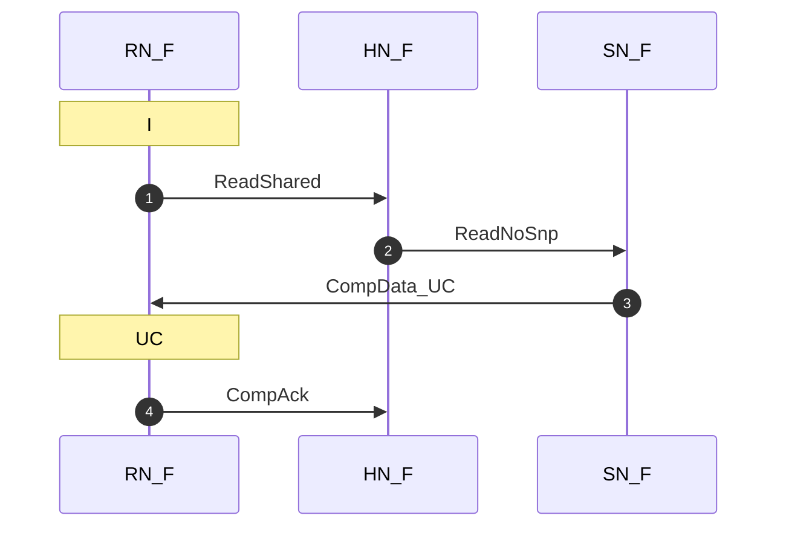
```mermaid
sequenceDiagram
autonumber
participant RN_F
participant HN_F
participant SN_F

note over RN_F: I
RN_F->>HN_F: ReadShared
HN_F->>SN_F: ReadNoSnp
SN_F->>RN_F :CompData_UC
note over RN_F: UC
RN_F->>HN_F: CompAck
```

### 5.1.2 read transactions with DMT and with snoops

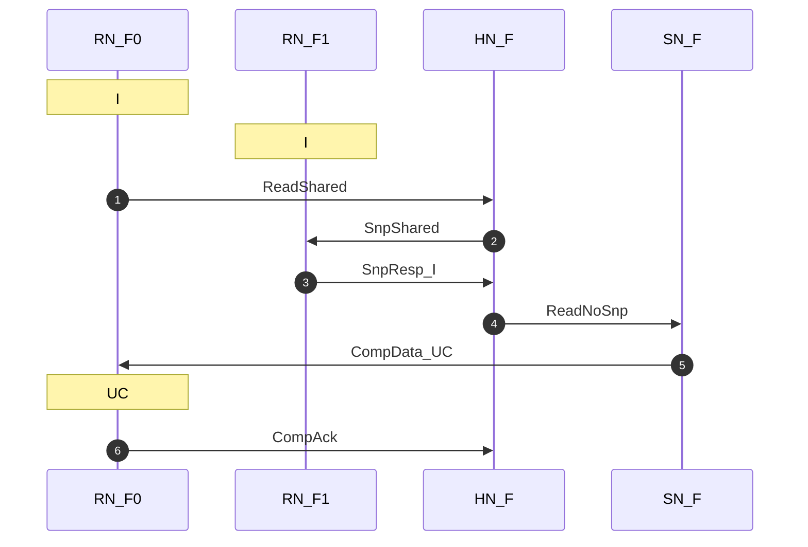
```mermaid
sequenceDiagram
autonumber
participant RN_F0
participant RN_F1
participant HN_F
participant SN_F

note over RN_F0: I
note over RN_F1: I
RN_F0->>HN_F: ReadShared
HN_F->>RN_F1: SnpShared
RN_F1->>HN_F: SnpResp_I
HN_F->>SN_F: ReadNoSnp
SN_F->>RN_F0 :CompData_UC
note over RN_F0: UC
RN_F0->>HN_F: CompAck
```

### 5.1.3 Read transaction with DCT

DCT from cache line in UC state

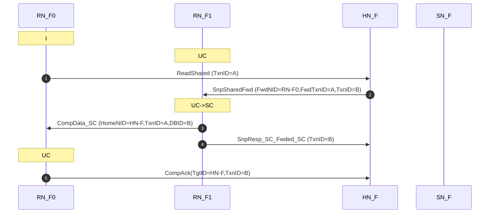
```mermaid
sequenceDiagram
autonumber
participant RN_F0
participant RN_F1
participant HN_F
participant SN_F

note over RN_F0: I
note over RN_F1: UC
RN_F0->>HN_F: ReadShared (TxnID=A)
HN_F->>RN_F1: SnpSharedFwd (FwdNID=RN-F0,FwdTxnID=A,TxnID=B)
note over RN_F1: UC->SC
RN_F1->>RN_F0: CompData_SC (HomeNID=HN-F,TxnID=A,DBID=B)
RN_F1->>HN_F: SnpResp_SC_Fwded_SC (TxnID=B)
note over RN_F0: UC
RN_F0->>HN_F: CompAck(TgtID=HN-F,TxnID=B)
```

Double data return in a DCT transaction

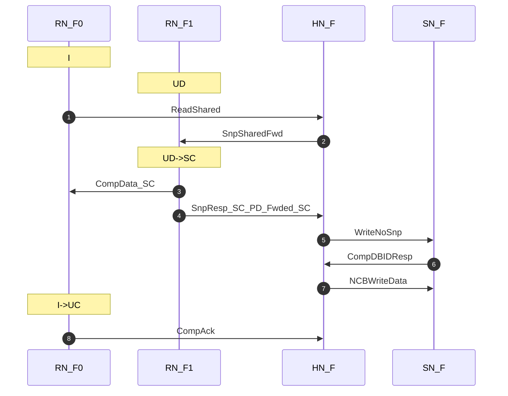
```mermaid
sequenceDiagram
autonumber
participant RN_F0
participant RN_F1
participant HN_F
participant SN_F

note over RN_F0: I
note over RN_F1: UD
RN_F0->>HN_F: ReadShared 
HN_F->>RN_F1: SnpSharedFwd 
note over RN_F1: UD->SC
RN_F1->>RN_F0: CompData_SC
RN_F1->>HN_F: SnpResp_SC_PD_Fwded_SC
HN_F->>SN_F: WriteNoSnp
SN_F->>HN_F: CompDBIDResp
HN_F->>SN_F: NCBWriteData
note over RN_F0: I->UC
RN_F0->>HN_F: CompAck
```

### 5.1.4 Read transaction with neither DMT nor DCT

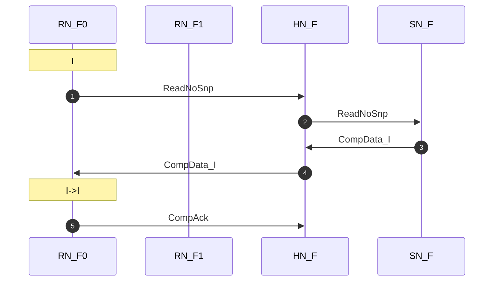
```mermaid
sequenceDiagram
autonumber
participant RN_F0
participant RN_F1
participant HN_F
participant SN_F

note over RN_F0: I
RN_F0->>HN_F: ReadNoSnp
HN_F->>SN_F: ReadNoSnp
SN_F->>HN_F: CompData_I
HN_F->>RN_F0: CompData_I
note over RN_F0: I->I
RN_F0->>HN_F: CompAck
```

### 5.1.5 Read transaction with snoop response with partial data and no memory update

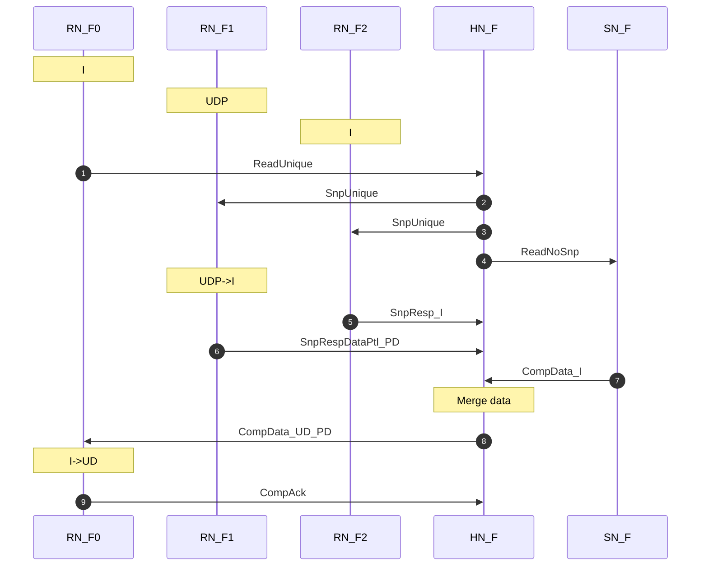
```mermaid
sequenceDiagram
autonumber
participant RN_F0
participant RN_F1
participant RN_F2
participant HN_F
participant SN_F

note over RN_F0: I
note over RN_F1: UDP
note over RN_F2: I
RN_F0->>HN_F: ReadUnique 
HN_F->>RN_F1: SnpUnique 
HN_F->>RN_F2: SnpUnique 
HN_F->>SN_F: ReadNoSnp 
note over RN_F1: UDP->I
RN_F2->>HN_F: SnpResp_I
RN_F1->>HN_F: SnpRespDataPtl_PD
SN_F->>HN_F: CompData_I
note over HN_F: Merge data
HN_F->>RN_F0: CompData_UD_PD
note over RN_F0: I->UD
RN_F0->>HN_F: CompAck
```

### 5.1.6 Read transaction with snoop response with partial data and memory update

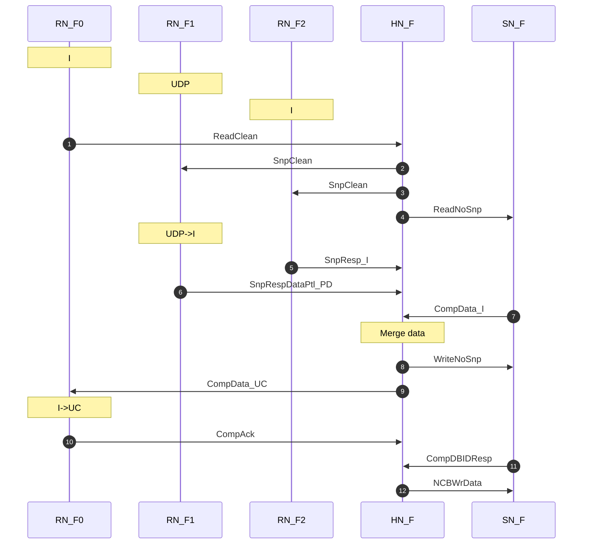
```mermaid
sequenceDiagram
autonumber
participant RN_F0
participant RN_F1
participant RN_F2
participant HN_F
participant SN_F

note over RN_F0: I
note over RN_F1: UDP
note over RN_F2: I
RN_F0->>HN_F: ReadClean 
HN_F->>RN_F1: SnpClean 
HN_F->>RN_F2: SnpClean
HN_F->>SN_F: ReadNoSnp 
note over RN_F1: UDP->I
RN_F2->>HN_F: SnpResp_I
RN_F1->>HN_F: SnpRespDataPtl_PD
SN_F->>HN_F: CompData_I
note over HN_F: Merge data
HN_F->>SN_F: WriteNoSnp
HN_F->>RN_F0: CompData_UC
note over RN_F0: I->UC
RN_F0->>HN_F: CompAck
SN_F->>HN_F: CompDBIDResp
HN_F->>SN_F: NCBWrData
```

### 5.1.7 ReadOnce* and ReadNoSnp with early Home deallocation

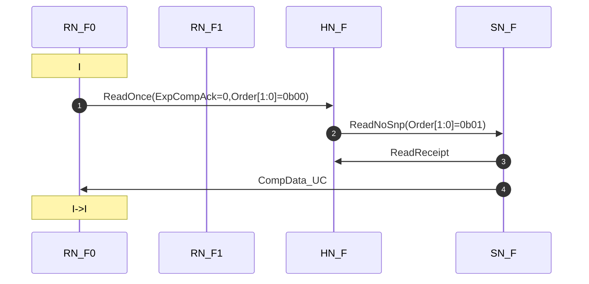
```mermaid
sequenceDiagram
autonumber
participant RN_F0
participant RN_F1
participant HN_F
participant SN_F

note over RN_F0: I
RN_F0->>HN_F: ReadOnce(ExpCompAck=0,Order[1:0]=0b00)
HN_F->>SN_F: ReadNoSnp(Order[1:0]=0b01)
SN_F->>HN_F: ReadReceipt
SN_F->>RN_F0: CompData_UC
note over RN_F0: I->I
```

### 5.1.8 ReadNoSnp transaction with DMT and separate Non-data and Data-only

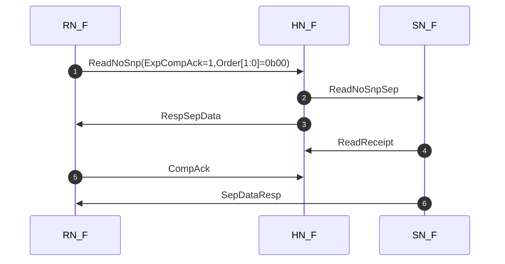
```mermaid
sequenceDiagram
autonumber
participant RN_F
participant HN_F
participant SN_F

RN_F->>HN_F: ReadNoSnp(ExpCompAck=1,Order[1:0]=0b00)
HN_F->>SN_F: ReadNoSnpSep
HN_F->>RN_F: RespSepData
SN_F->>HN_F :ReadReceipt
RN_F->>HN_F: CompAck
SN_F->>RN_F: SepDataResp
```

### 5.1.9 ReadNoSnp transaction with DMT with ordering and separate Non-data and Data-only

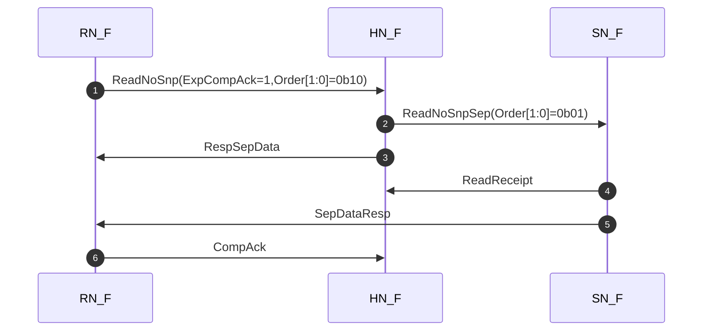
```mermaid
sequenceDiagram
autonumber
participant RN_F
participant HN_F
participant SN_F

RN_F->>HN_F: ReadNoSnp(ExpCompAck=1,Order[1:0]=0b10)
HN_F->>SN_F: ReadNoSnpSep(Order[1:0]=0b01)
HN_F->>RN_F: RespSepData
SN_F->>HN_F :ReadReceipt
SN_F->>RN_F: SepDataResp
RN_F->>HN_F: CompAck
```

## 5.2 Dataless transaction flows

### 5.2.1 Dataless transaction without memory update

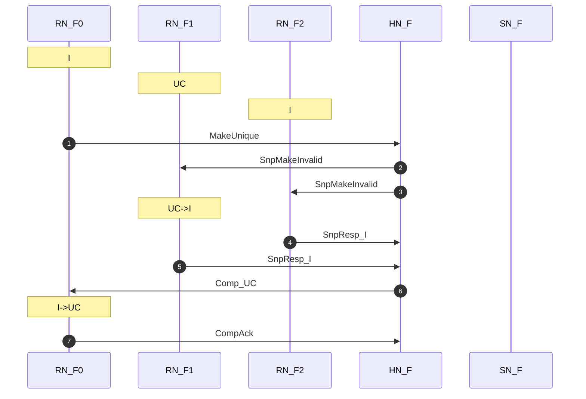
```mermaid
sequenceDiagram
autonumber
participant RN_F0
participant RN_F1
participant RN_F2
participant HN_F
participant SN_F

note over RN_F0: I
note over RN_F1: UC
note over RN_F2: I
RN_F0->>HN_F: MakeUnique 
HN_F->>RN_F1: SnpMakeInvalid 
HN_F->>RN_F2: SnpMakeInvalid 
note over RN_F1: UC->I
RN_F2->>HN_F: SnpResp_I
RN_F1->>HN_F: SnpResp_I
HN_F->>RN_F0: Comp_UC
note over RN_F0: I->UC
RN_F0->>HN_F: CompAck
```

### 5.2.2 Dataless transaction with memory update

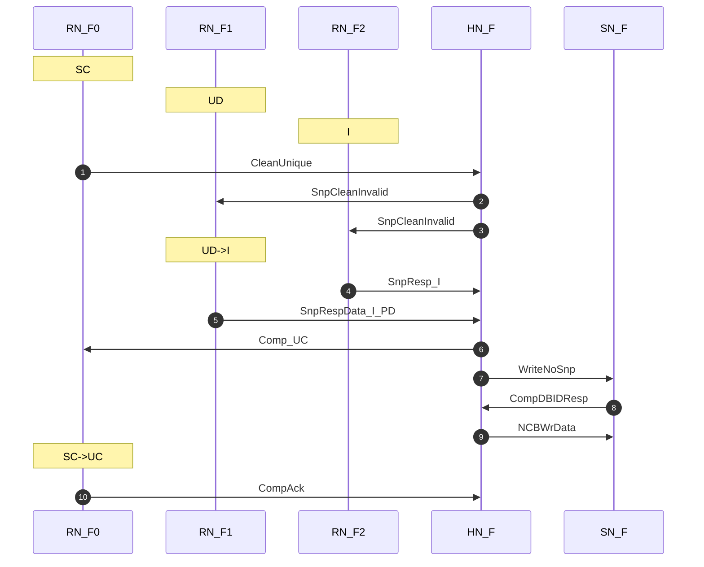
```mermaid
sequenceDiagram
autonumber
participant RN_F0
participant RN_F1
participant RN_F2
participant HN_F
participant SN_F

note over RN_F0: SC
note over RN_F1: UD
note over RN_F2: I
RN_F0->>HN_F: CleanUnique 
HN_F->>RN_F1: SnpCleanInvalid 
HN_F->>RN_F2: SnpCleanInvalid 
note over RN_F1: UD->I
RN_F2->>HN_F: SnpResp_I
RN_F1->>HN_F: SnpRespData_I_PD
HN_F->>RN_F0: Comp_UC
HN_F->>SN_F: WriteNoSnp
SN_F->>HN_F: CompDBIDResp
HN_F->>SN_F: NCBWrData
note over RN_F0: SC->UC
RN_F0->>HN_F: CompAck
```

> 为什么RN_F0没有拿到数据就能变成UC状态？
>
> 因为不带数据的UC态，一般马上会改写cacheline，改之后就有数据了。另外，在改数据之前，snp它不会回数据的，改写cacheline之后可以回数据。

### 5.2.3 Persistent CMO with snoop and separate Comp and Persist

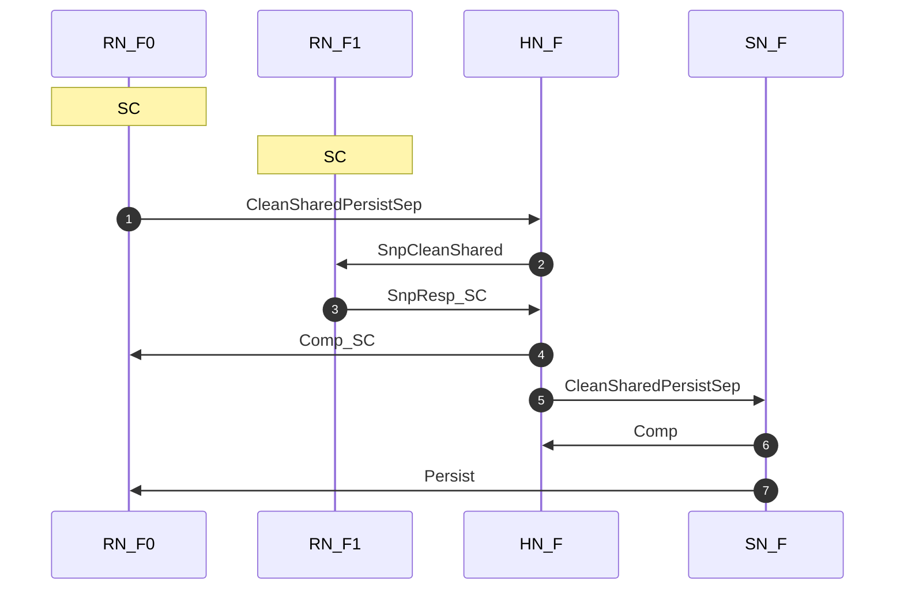
```mermaid
sequenceDiagram
autonumber
participant RN_F0
participant RN_F1
participant HN_F
participant SN_F

note over RN_F0: SC
note over RN_F1: SC
RN_F0->>HN_F: CleanSharedPersistSep
HN_F->>RN_F1: SnpCleanShared
RN_F1->>HN_F: SnpResp_SC
HN_F->>RN_F0: Comp_SC
HN_F->>SN_F: CleanSharedPersistSep
SN_F->>HN_F: Comp
SN_F->>RN_F0: Persist
```

### 5.2.4 Evict transaction

The cache state at the Requester must change to Invalid before the Evict message is sent.

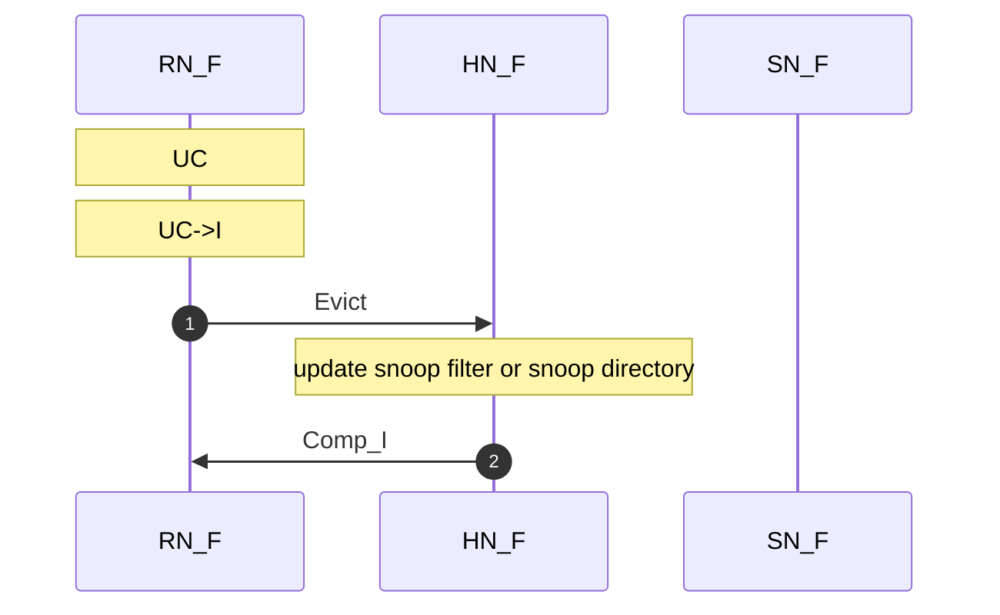
```mermaid
sequenceDiagram
autonumber
participant RN_F
participant HN_F
participant SN_F

note over RN_F: UC
note over RN_F: UC->I
RN_F->>HN_F: Evict
note over HN_F: update snoop filter or snoop directory
HN_F->>RN_F: Comp_I
```

## 5.3 Write transaction flows

### 5.3.1 Write transaction with no snoop and separate responses

This flow example shows Comp is sent after CompDBIDResp is received from SN-F. However, HN-F is permitted to send Comp anytime after it receives the WriteNoSnp request from RN-F0.

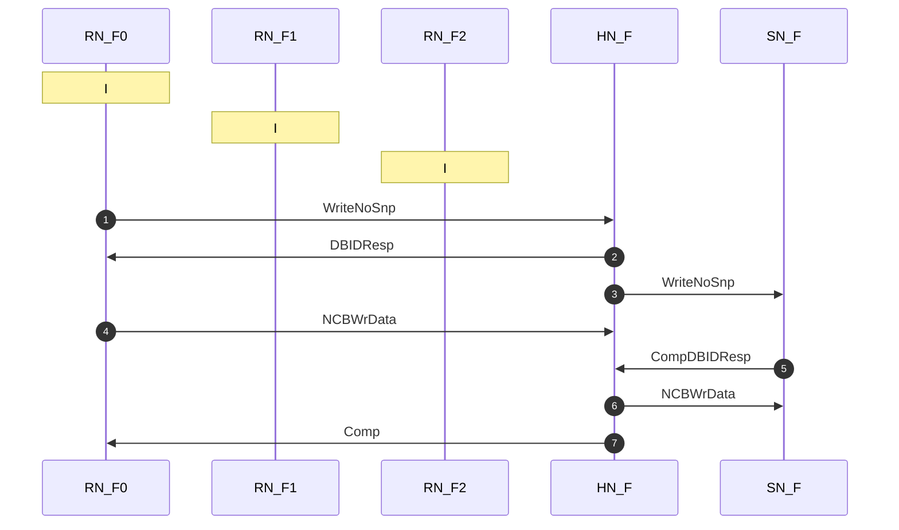
```mermaid
sequenceDiagram
autonumber
participant RN_F0
participant RN_F1
participant RN_F2
participant HN_F
participant SN_F

note over RN_F0: I
note over RN_F1: I
note over RN_F2: I
RN_F0->>HN_F: WriteNoSnp 
HN_F->>RN_F0: DBIDResp
HN_F->>SN_F: WriteNoSnp 
RN_F0->>HN_F: NCBWrData
SN_F->>HN_F: CompDBIDResp
HN_F->>SN_F: NCBWrData
HN_F->>RN_F0: Comp
```

### 5.3.2 Write transaction with snoop and separate responses

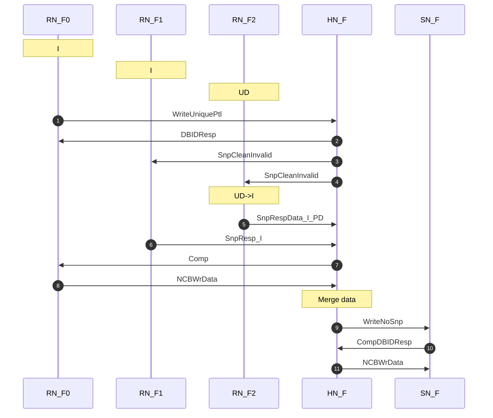
```mermaid
sequenceDiagram
autonumber
participant RN_F0
participant RN_F1
participant RN_F2
participant HN_F
participant SN_F

note over RN_F0: I
note over RN_F1: I
note over RN_F2: UD
RN_F0->>HN_F: WriteUniquePtl 
HN_F->>RN_F0: DBIDResp
HN_F->>RN_F1: SnpCleanInvalid
HN_F->>RN_F2: SnpCleanInvalid
note over RN_F2: UD->I
RN_F2->>HN_F: SnpRespData_I_PD
RN_F1->>HN_F: SnpResp_I
HN_F->>RN_F0: Comp
RN_F0->>HN_F: NCBWrData
note over HN_F: Merge data
HN_F->>SN_F: WriteNoSnp
SN_F->>HN_F: CompDBIDResp
HN_F->>SN_F: NCBWrData
```

### 5.3.3 CopyBack write transaction to memory

CBWrData = CopyBackWrData

NCBWrData = NonCopyBackWrData

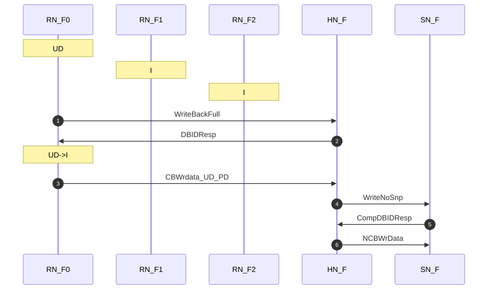
```mermaid
sequenceDiagram
autonumber
participant RN_F0
participant RN_F1
participant RN_F2
participant HN_F
participant SN_F

note over RN_F0: UD
note over RN_F1: I
note over RN_F2: I
RN_F0->>HN_F: WriteBackFull 
HN_F->>RN_F0: DBIDResp
note over RN_F0: UD->I
RN_F0->>HN_F: CBWrdata_UD_PD
HN_F->>SN_F: WriteNoSnp
SN_F->>HN_F: CompDBIDResp
HN_F->>SN_F: NCBWrData
```

## 5.4 Atomic transaction flows

### 5.4.1 Atomic transactions with data return

**Atomic transaction with snoops and data return**

the CompData_I response from HN-F can be sent as soon as all Snoop responses are received.
Alternatively, to aid error reporting, CompData_I can be delayed until NCBWrData is received from the Requester and the atomic operation is executed.

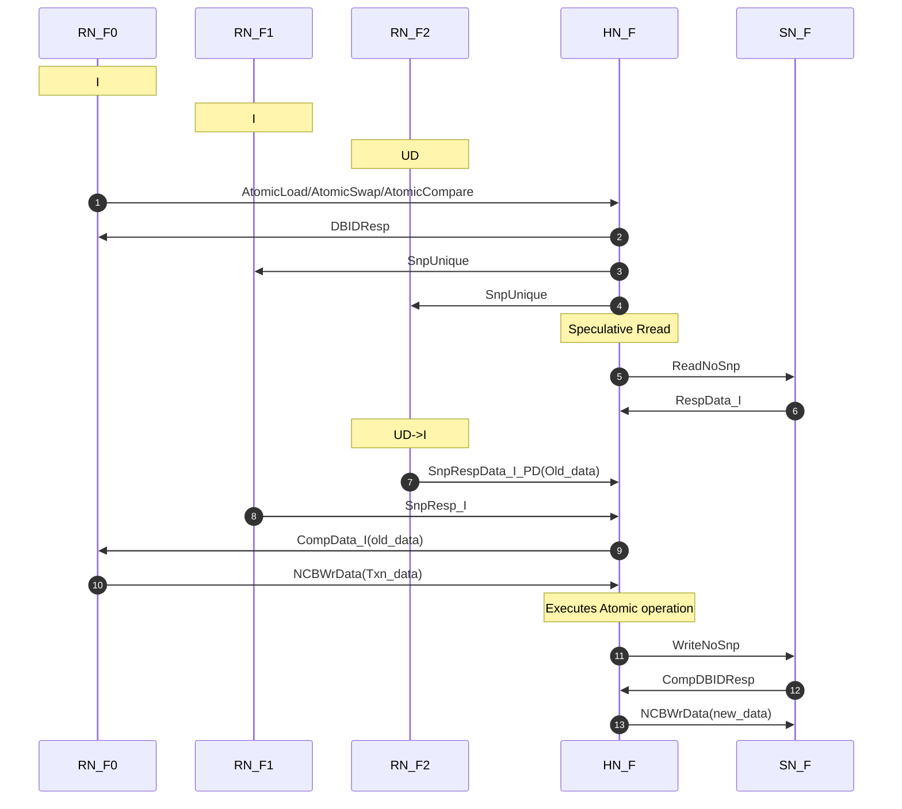
```mermaid
sequenceDiagram
autonumber
participant RN_F0
participant RN_F1
participant RN_F2
participant HN_F
participant SN_F

note over RN_F0: I
note over RN_F1: I
note over RN_F2: UD
RN_F0->>HN_F: AtomicLoad/AtomicSwap/AtomicCompare 
HN_F->>RN_F0: DBIDResp
HN_F->>RN_F1: SnpUnique
HN_F->>RN_F2: SnpUnique
note over HN_F: Speculative Rread
HN_F->>SN_F: ReadNoSnp
SN_F->>HN_F: RespData_I
note over RN_F2: UD->I
RN_F2->>HN_F: SnpRespData_I_PD(Old_data)
RN_F1->>HN_F: SnpResp_I
HN_F->>RN_F0: CompData_I(old_data)
RN_F0->>HN_F: NCBWrData(Txn_data)
note over HN_F: Executes Atomic operation
HN_F->>SN_F: WriteNoSnp
SN_F->>HN_F: CompDBIDResp
HN_F->>SN_F: NCBWrData(new_data)
```

**Atomic transaction without snoops and with data return**

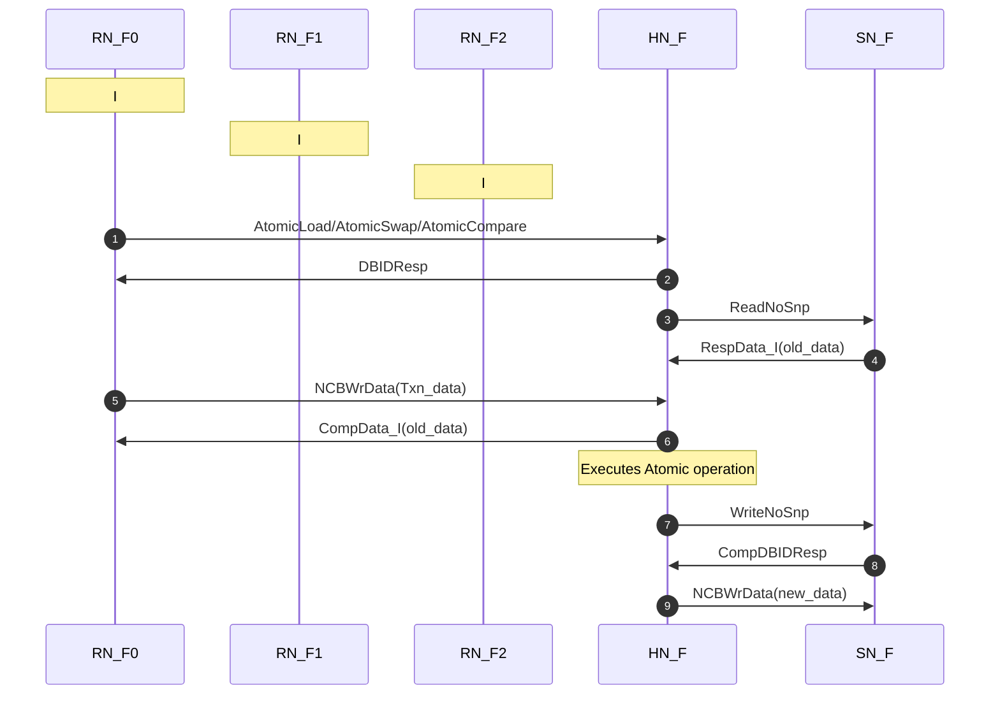
```mermaid
sequenceDiagram
autonumber
participant RN_F0
participant RN_F1
participant RN_F2
participant HN_F
participant SN_F

note over RN_F0: I
note over RN_F1: I
note over RN_F2: I
RN_F0->>HN_F: AtomicLoad/AtomicSwap/AtomicCompare 
HN_F->>RN_F0: DBIDResp
HN_F->>SN_F: ReadNoSnp
SN_F->>HN_F: RespData_I(old_data)
RN_F0->>HN_F: NCBWrData(Txn_data)
HN_F->>RN_F0: CompData_I(old_data)
note over HN_F: Executes Atomic operation
HN_F->>SN_F: WriteNoSnp
SN_F->>HN_F: CompDBIDResp
HN_F->>SN_F: NCBWrData(new_data)
```

### 5.4.2 Atomic transaction without data return

**Atomic transaction with snoops and without data return**

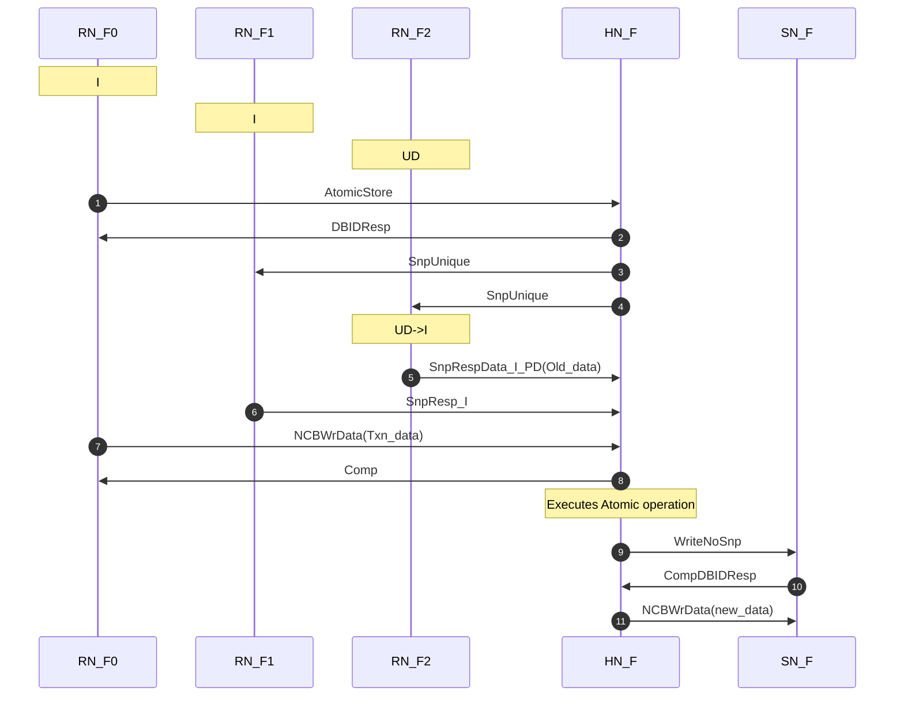
```mermaid
sequenceDiagram
autonumber
participant RN_F0
participant RN_F1
participant RN_F2
participant HN_F
participant SN_F

note over RN_F0: I
note over RN_F1: I
note over RN_F2: UD
RN_F0->>HN_F: AtomicStore 
HN_F->>RN_F0: DBIDResp
HN_F->>RN_F1: SnpUnique
HN_F->>RN_F2: SnpUnique
note over RN_F2: UD->I
RN_F2->>HN_F: SnpRespData_I_PD(Old_data)
RN_F1->>HN_F: SnpResp_I
RN_F0->>HN_F: NCBWrData(Txn_data)
HN_F->>RN_F0: Comp
note over HN_F: Executes Atomic operation
HN_F->>SN_F: WriteNoSnp
SN_F->>HN_F: CompDBIDResp
HN_F->>SN_F: NCBWrData(new_data)
```

**Atomic transaction without snoops and without data return**

```mermaid
sequenceDiagram
autonumber
participant RN_F0
participant RN_F1
participant RN_F2
participant HN_F
participant SN_F

note over RN_F0: I
note over RN_F1: I
note over RN_F2: I
RN_F0->>HN_F: AtomicStore 
HN_F->>RN_F0: DBIDResp
HN_F->>RN_F0: Comp
HN_F->>SN_F: ReadNoSnp
RN_F0->>HN_F: NCBWrData(Txn_data)
SN_F->>HN_F: RespData_I(old_data)
note over HN_F: Executes Atomic operation
HN_F->>SN_F: WriteNoSnp
SN_F->>HN_F: CompDBIDResp
HN_F->>SN_F: NCBWrData(new_data)
```

### 5.4.3 Atomic operation executed at the SN

```mermaid
sequenceDiagram
autonumber
participant RN_F0
participant RN_F1
participant RN_F2
participant HN_F
participant SN_F

note over RN_F0: I
note over RN_F1: I
note over RN_F2: UD
RN_F0->>HN_F: AtomicStore (Normal, Snoopable)
HN_F->>RN_F0: DBIDResp
HN_F->>RN_F1: SnpUnique
HN_F->>RN_F2: SnpUnique
note over RN_F2: UD->I
RN_F2->>HN_F: SnpRespData_I_PD(Old_data)
RN_F1->>HN_F: SnpResp_I
RN_F0->>HN_F: NCBWrData(Txn_data)
HN_F->>RN_F0: Comp
HN_F->>SN_F: WriteNoSnp
SN_F->>HN_F: CompDBIDResp
HN_F->>SN_F: NCBWrData
HN_F->>SN_F: AtomicStore
SN_F->>HN_F: DBIDResp
HN_F->>SN_F: NCBWrData(new_data)
SN_F->>HN_F: Comp
note over SN_F: Execute Atomic operation
```

## 5.5 Stash transaction flows

### 5.5.1 Write with Stash hint

```mermaid
sequenceDiagram
autonumber
participant RN_F0
participant RN_F1
participant RN_F2
participant HN_F
participant SN_F

note over RN_F0: I
note over RN_F1: SC
note over RN_F2: I
RN_F0->>HN_F: WriteUniqueFullStash(StashNID=RN_F1)
HN_F->>RN_F0: DBIDResp
HN_F->>RN_F1: SnpMakeInvalidStash
HN_F->>RN_F2: SnpUnique
note over RN_F1: UC->I
RN_F2->>HN_F: SnpResp_I
RN_F1->>HN_F: SnpResp_I_Read
RN_F0->>HN_F: NCBWrData
HN_F->>RN_F0: Comp_I
HN_F->>RN_F1: CompData_UD_PD
RN_F1->>HN_F: CompAck
```

### 5.5.2 Independent Stash request

```mermaid
sequenceDiagram
autonumber
participant RN_F0
participant RN_F1
participant HN_F
participant SN_F

note over RN_F1: I
RN_F0->>HN_F: StashOnceShared(StashNID=RN_F1)
HN_F->>RN_F1: SnpStashShared
HN_F->>SN_F: ReadNoSnp
HN_F->>RN_F0: Comp
RN_F1->>HN_F: SnpResp_I_Read
SN_F->>HN_F: CompData_I
HN_F->>RN_F1: CompData_UC
note over RN_F1: I->UC
RN_F1->>HN_F: CompAck
```

## 5.6 Hazard handling examples

### 5.6.1 CopyBack-Snoop hazard at RN-F

**CopyBack-Snoop hazard at RN-F example**

```mermaid
sequenceDiagram
autonumber
participant RN_F0
participant RN_F1
participant HN_F

note over RN_F0: UD
note over RN_F1: I
RN_F1->>HN_F: Req1: ReadShared
RN_F0-->>HN_F: Req2: WriteBack
HN_F->>RN_F0: SnpShared
note over HN_F: timeA: Hazard detected, Req2 progress blocked
note over RN_F0: UD->SC
note over RN_F0: timeC: Hazard with Copyback detected, but ignored
RN_F0->>HN_F: SnpRespData_SC_PD
HN_F->>RN_F1: CompData_SC
RN_F1->>HN_F: CompAck
note over HN_F: timeB: Req2 progress un-blocked
HN_F-->>RN_F0: CompDBIDResp
note over RN_F0: US->I
note over RN_F0: TimeD: CopyBack Completed with a WriteData response
RN_F0-->>HN_F: CopyBackWrData_SC(PS=SC, NS(implied)=I)
```

PS = PresentState

NS = NextState

**CopyBack-Snoop hazard with no cache state change example**

```mermaid
sequenceDiagram
autonumber
participant RN_F0
participant RN_F1
participant HN_F
participant SN_F

note over RN_F0: UD
note over RN_F1: I
RN_F1->>HN_F: ReadOnce
RN_F0-->>HN_F: WriteBack
HN_F->>RN_F0: SnpOnce
note over HN_F: Hazard detected, WriteBack progress blocked
note over RN_F0: UD->UD
note over RN_F0: Hazard detected, but ignored
RN_F0->>HN_F: SnpRespData_UD
HN_F->>RN_F1: CompData_I
RN_F1->>HN_F: CompAck
note over HN_F: ReadOnce does not write back Data
note over HN_F: WriteBack progress un-blocked
HN_F-->>RN_F0: CompDBIDResp
note over RN_F0: US->I
note over RN_F0: CopyBack Completed with a WriteData response
RN_F0-->>HN_F: CopyBackWrData_UD(PS=UD, NS(implied)=I)
HN_F-->>SN_F: WrNoSnp
```

### 5.6.2 Request hazard at HN-F

```mermaid
sequenceDiagram
autonumber
participant RN_F0
participant RN_F1
participant RN_F2
participant HN_F
participant SN_F

note over RN_F0: SC
note over RN_F1: I
note over RN_F2: I
RN_F2->>HN_F: Req1: ReadShared
RN_F0-->>HN_F: Req2: ReadUnique
note over HN_F: Hazard detected, Req2 progress blocked
HN_F->>SN_F: ReadNoSnp
HN_F->>RN_F0: SnpShared
HN_F->>RN_F1: SnpShared
RN_F1->>HN_F: SnpResp_I
RN_F0->>HN_F: SnpResp_SC
SN_F->>HN_F: CompData_I
HN_F->>RN_F2: CompData_SC
note over RN_F2: I->SC
RN_F2->>HN_F: CompAck
note over HN_F: Req2 progress un-blocked
HN_F-->>SN_F: ReadNoSnp
HN_F-->>RN_F1: SnpUnique
HN_F-->>RN_F2: SnpUnique
note over RN_F2: SC->I
RN_F2-->>HN_F: SnpResp_I
RN_F1-->>HN_F: SnpResp_I
SN_F-->>HN_F: CompData_I
HN_F-->>RN_F0: CompData_UC
note over RN_F0: SC->UC
RN_F0-->>HN_F: CompAck
```

### 5.6.3 Read - CopyBack or Dataless - CopyBack hazard at HN-F

```mermaid
sequenceDiagram
autonumber
participant RN_F0
participant RN_F1
participant RN_F2
participant HN_F
participant SN_F

note over RN_F0: SD
note over RN_F1: I
note over RN_F2: I
RN_F2->>HN_F: Req1: ReadShared
RN_F0-->>HN_F: Req2: WriteBack
note over HN_F: Hazard detected, Req2 progress blocked
HN_F->>RN_F0: SnpShared
note over RN_F0: UD->SC
RN_F0->>HN_F: SnpRespData_SC_PD
HN_F-->>SN_F: WriteNoSnp
HN_F->>RN_F2: CompData_SC
note over RN_F2: I->SC
RN_F2->>HN_F: CompAck
SN_F-->>HN_F: CompDBIDResp
HN_F-->>SN_F: NCBWrData
note over HN_F: Req2 progress un-blocked
HN_F-->>RN_F0: CompDBIDResp
note over RN_F0: SC->I
RN_F0-->>HN_F: CopyBackWrData_SC(PS=SC,NS(implied=I)
```

### 5.6.4 Request-CompAck to HN-F race hazard

After completion, a request might silently evict the cache line from the cache and generate another request to the same address. For example:

1. The regenerated request reaches the HN-F before the CompAck response associated with the earlier request.
2. The HN-F detects an address hazard and blocks the processing of the new request until the CompAck response is received.

In such a scenario, upon arrival at HN-F, the CompAck response deallocates the previous request from the HN-F and unblocks the processing of the new request.
