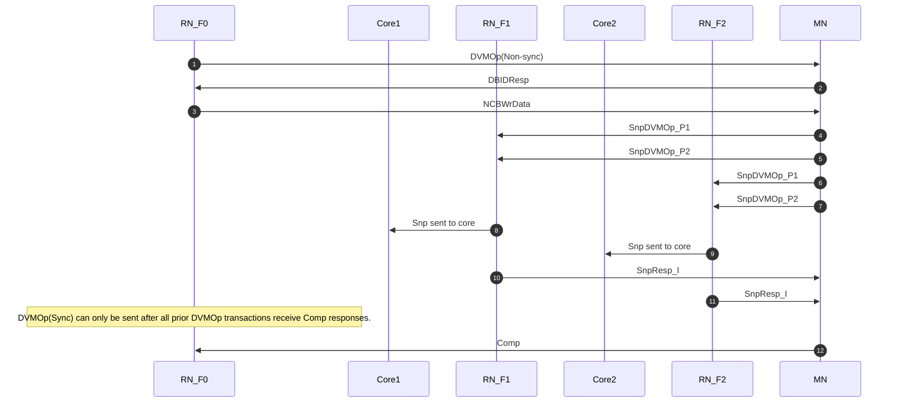
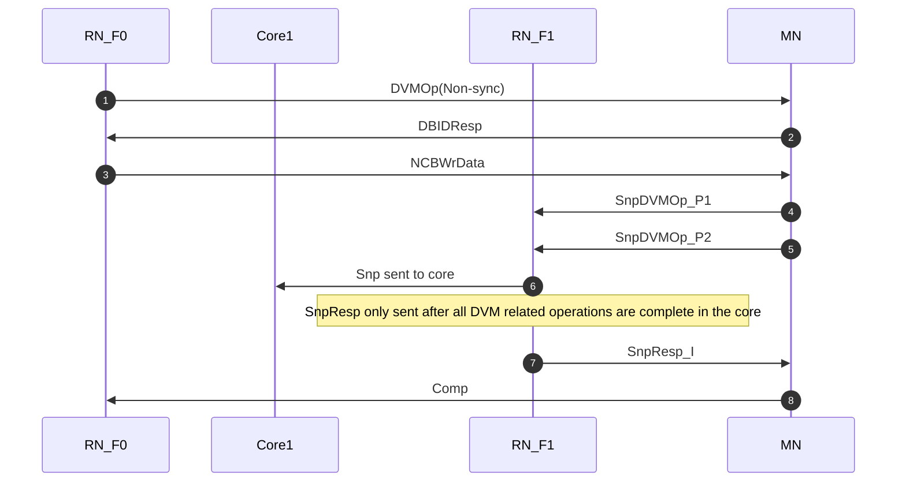

# 8. DVM Operations

## 8.1 DVM transaction flow

### 8.1.1 Non-sync type DVM transaction flow

required steps:

1. RN_F0发送DVMOp(Non-sync)给MN，使用write semantics。
2. MN接收request，返回DBIDResp response。
3. RN_F0发送8-byte data packet on data channel
4. MN广播SnpDVMOp snoop给所有的RN_F和RN_D nodes In the system. SnpDVMOp在snoop channel发送，需要发送两个snoop request，这两部分snoop分别标记为P1和P2。注意两部分必须使用相同的Transaction ID(TxnID)，RN必须有可用的资源来接收SnpDVMOp。
5. 完成请求后，每个收到SnpDVMOp的RN返回SnpRsp response给MN。发送SnpResp意味着该RN已经forwarded SnpDVMOp给要求的RN结构，而且已经释放完成所需要的资源，可以接收其他DVM操作。但不意味着本次要求的DVM操作已经完成。
6. 收到所有SnpResp response后，MN发送Comp给requesting node

#### DVM early Comp for Non-sync DVMOps

对于Non-Sync DVMOp，协议允许MN提前发送Comp，不用等要求的snooping RN完成。这时，MN必须负责该Non-syn DVMOp和其他所有Sync DVMOp的保序。如果MN不提供这样的保证，那它必须等snooping完成后再发Comp。

对于Non-sync DVMOp，MN在使能提前发送Comp时，允许投机的合并Comp和DBIDResp成CompDBIDResp response。

MN必须等Sync DVMOp的Snoop完成后，再发送Comp。

### 8.1.2 Sync type DVM transaction flow

required steps:

1. RN_F0发送DVMOp(Non-sync)给MN。注意，在DVMOp(Sync)发送之前，当前RN的所有的DVMOp request必须保证已经收到Comp response。
2. MN接收request，返回DBIDResp response。
3. RN_F0发送8-byte data packet on data channel。
4. MN广播SnpDVMOp snoop给所有的RN_F和RN_D nodes In the system. SnpDVMOp在snoop channel发送，需要发送两个snoop request，这两部分snoop分别标记为P1和P2。注意两部分必须使用相同的Transaction ID(TxnID)，RN必须有可用的资源来接收SnpDVMOp。
5. 完成请求后，每个收到SnpDVMOp的RN返回SnpRsp response给MN。发送SnpResp意味着该RN已经forwarded SnpDVMOp给要求的RN结构，而且已经释放完成所需要的资源，可以接收其他DVM操作。
6. 收到所有SnpResp response后，MN发送Comp给requesting node

### 8.1.3 Flow control

DVMOp request flow control:

- DVMOp可以接收MN的RetryAck
- 收到RetryAck后必须等来自MN的PCrdGrant response。
- 在RN发送DVMOp(Sync)前，必须保证之前的DVMOp已经完成。
- interconnect必须保证DVMOp(Non-sync)的forward progress流程，意味着MN至少保证有一个entry保留给DVMOp(Non-Sync)。
- 对于同一个RN，如果DVMOp(Sync)不要要求保证DVMOp(Non-Sync)已完成，这时允许DVMOp(Non-Sync)和DVMOp(Sync)重叠。

SnpDVMOp flow control:

- 每个SnpDVMOp需要两个SnpDVMOp request packet
- 两个SnpDVMOp packet需要使用相同的TxnID
- 两个SnpDVMOp packet的发送和接收可以乱序
- MN可以outstanding多个SnpDVMOp(Non-sync) transactions
- MN只能outstanding一个SnpDVMOp(Sync) transaction给一个RN
- 为了防止死锁，需要收到RN已经pre-allocated resources来接收两个SnpDVMOp packet后，再发出SnpDVMOp packet。
- RN必须等收到两个SnpDVMOp request packet后，才能返回response
- RN只有当可以接收下一个SnpDVMOp时，才返回一个response给SnpDVMOp。
- 每个RN_F和RN_D确定其可以同时接收SnpDVMOp的数量。
- 每个RN_F和RN_D必须至少能接收一个SnpDVMOp(Non-Sync)和一个SnpDVMOp(Sync) transaction。即SnpDVMOp数量的最小值是2，这也是默认值。

### 8.1.4 DVMOp field value restrictions

Request的Size必须是8byte，其他不使用的域段Must be zero

### 8.1.5 Field value requirements

对于单个DVMOp的两个SnpDVMOp request packet，必须有相同的TxnID，Opcode，SrcID，TgtID。

## 8.2 DVM Operation types

The following DVM Operations are supported:
• TLB Invalidate.
• Branch Predictor Invalidate.
• Instruction Cache Invalidate:
— Physical address invalidate.
— Virtual address invalidate.
• Synchronization.

### 8.2.1 DVMOp payload

### 8.2.2 DVMOp and SnpDVMOp packet

## 8.3 DVM Operations

8.3.1 TLB Invalidate

8.3.2 Branch Predictor Invalidate

8.3.3 Physical Instruction Cache Invalidate

8.3.4 Virtual Instruction Cache Invalidate

8.3.5 Synchronization
